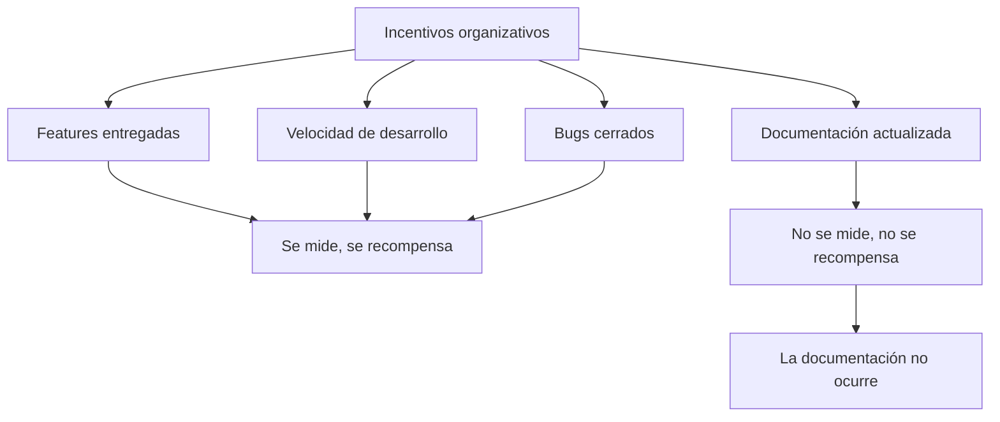
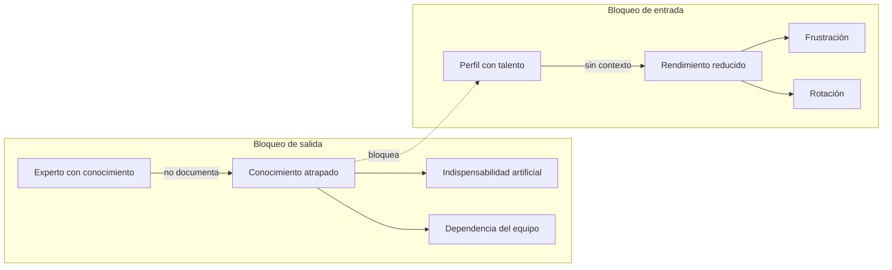

La IA ha eliminado la última excusa para no documentar: el tiempo.

Antes, documentar bien requería horas. Ahora, con un agente que estructura, redacta y formatea a partir de tus notas en minutos, el coste de producir documentación útil se ha reducido de forma radical. Ya no es una cuestión de cuánto tarda. Es una cuestión de querer hacerlo.

Y ahí es donde aparece el problema real. Porque en muchas organizaciones, el tiempo nunca fue la razón. Era la excusa.

---

## Por qué las organizaciones no documentan

He trabajado en equipos de todos los tamaños. Y el patrón se repite con una regularidad que ya no sorprende.

La organización declara que la documentación es importante. Tiene una wiki, tiene un Confluence, tiene plantillas. Nadie las usa. O las usa para documentar lo que ya está en el código. O las actualiza durante el sprint de documentación que ocurre una vez al año y que todos odian.

¿Por qué?

**Porque los incentivos van en sentido contrario.**

En la mayoría de las organizaciones, lo que se mide es la entrega. Features shipped. Story points completados. Velocidad de desarrollo. La documentación no aparece en ningún dashboard. No está en los OKRs del equipo. No forma parte de la definición de "hecho".

Lo que no se mide no se hace. No porque la gente sea mala, sino porque la atención es finita y se dirige hacia donde está el incentivo.

Añade a eso una cultura donde el experto visible tiene más valor percibido que el equipo que funciona sin héroes. Donde ser el único que sabe cómo funciona algo es una forma de seguridad laboral. Donde compartir conocimiento se siente, aunque nadie lo diga en voz alta, como debilitarse.

El resultado es predecible.

---

## Los dos tipos de bloqueo de talento

Cuando el conocimiento no fluye en una organización, el talento se desperdicia de dos formas distintas. Y las dos son costosas.

### El talento que no puede

Es la persona que tiene capacidad, voluntad y experiencia. Pero no tiene información.

No sabe cómo está montado el sistema que tiene que modificar. No entiende por qué ciertas decisiones se tomaron así. No tiene acceso a los criterios que guían las decisiones técnicas. Pregunta y le dicen que pregunte a otra persona. Esa persona está ocupada. Cuando por fin llega la respuesta, el contexto ha cambiado.

Este perfil existe en todas las organizaciones. Es el nuevo que tarda seis meses en ser productivo. El senior que no puede tomar decisiones autónomas porque el contexto está en la cabeza de otra persona. El equipo entero que depende de un individuo para avanzar.

El coste no es solo su tiempo perdido. Es lo que esa persona podría haber producido si hubiera tenido el contexto desde el principio. Es la diferencia entre lo que entregó y lo que podría haber entregado. Ese gap, multiplicado por todos los perfiles bloqueados de la organización, es enorme — y casi nunca se calcula.

### El talento que no quiere

Es la otra cara. La persona que tiene el conocimiento y no lo comparte.

A veces es consciente. Entiende que su indispensabilidad le protege y la cultiva activamente. Retiene información que debería fluir. Centraliza decisiones que podrían ser tomadas por otros. Crea dependencia de forma deliberada.

A veces es inconsciente. No es que quiera retener — es que nunca ha desarrollado el hábito ni el lenguaje para transmitir lo que sabe. El conocimiento tácito que lleva años acumulando le parece demasiado obvio para documentar. "Cualquiera lo sabría." No. No lo saben.

En ambos casos, el resultado es el mismo: una organización que no puede crecer sin ese individuo. Que no puede redistribuir trabajo. Que no puede sustituir a esa persona cuando se va — y se irá, tarde o temprano.

---

## El coste que las organizaciones no calculan

Hay un cálculo que casi ninguna organización hace porque es incómodo de hacer.

¿Cuánto vale un empleado que trabaja al 40% de su capacidad porque no tiene el contexto para trabajar al 100%? ¿Cuánto cuesta reconstruir el conocimiento que se pierde cuando el experto se va? ¿Cuántas decisiones subóptimas se toman porque el contexto no estaba disponible en el momento en que hacía falta?

Algunos datos que sí se pueden medir:

- El coste de onboarding de un nuevo empleado en un equipo sin documentación es entre 3 y 6 meses de productividad reducida. En un senior, eso son decenas de miles de euros de valor no generado.
- El bus factor de uno — el proyecto que muere si una persona se va — es un riesgo existencial que aparece regularmente como sorpresa, aunque nunca debería serlo.
- La rotación provocada por frustración de talento bloqueado: los mejores se van antes. Se quedan los que aceptan la disfunción. La organización se degrada lentamente sin que nadie lo nombre.

Y el que se queda por indispensabilidad también paga un precio. Está disponible veinticuatro horas. Es el cuello de botella de todo. No puede crecer porque tiene que mantener la deuda de conocimiento que generó. Es una trampa disfrazada de seguridad.

---

## La IA como acelerador y como revelador

La IA generativa ha cambiado dos cosas al mismo tiempo.

**Acelerador:** El tiempo que costaba producir documentación útil era real. Estructurar, redactar, mantener. Ahora ese coste se ha reducido de forma radical. Un agente puede tomar tus notas, una conversación, el código que escribiste, y producir documentación estructurada en minutos. La excusa del tiempo ya no existe.

**Revelador:** Los sistemas que trabajan con agentes necesitan contexto documentado para funcionar. Los equipos que no documentan lo descubren inmediatamente: el agente falla, repite errores, genera inconsistencias. El coste de no documentar, que antes era difuso y futuro, ahora es inmediato y personal.

Esto pone en evidencia algo que siempre fue verdad pero que ahora no se puede ignorar: las organizaciones donde el conocimiento está retenido en personas no solo trabajan por debajo de su potencial. Están activamente bloqueando la ventaja que la IA podría darles.

Un agente es tan bueno como el contexto que recibe. Una organización donde el contexto está en la cabeza de tres personas tiene, estructuralmente, agentes peores que la competencia que documenta. No por el modelo. Por la cultura.

---

## Lo que hay que cambiar

El problema no se resuelve con más herramientas. No es un problema de Confluence vs. Notion vs. Markdown. Es un problema de incentivos, cultura y estructura.

**Medir lo que importa.** Si la documentación no está en la definición de "hecho", no ocurrirá. El equipo que entrega sin documentar no ha entregado del todo.

**Hacer visible el bus factor.** Nombrarlo en las retrospectivas. Tratarlo como el riesgo técnico que es. Distribuir conocimiento de forma activa, no esperar a que ocurra solo.

**Cambiar el incentivo del experto.** La organización que recompensa la indispensabilidad individual tiene exactamente lo que merece. La que recompensa a quien hace que otros sean más capaces, tiene equipos que escalan.

**Aprovechar la IA para bajar el coste de entrada.** Si documentar es fácil y rápido, desaparece la fricción. Si la fricción desaparece, el único obstáculo que queda es la voluntad. Y la voluntad es más fácil de abordar cuando el coste es bajo.

---

## El patrón siempre fue el mismo

Lo que la IA ha hecho no es inventar un problema nuevo. Es hacer urgente uno que siempre existió.

El conocimiento retenido en personas fue siempre un pasivo disfrazado de activo. El experto imprescindible fue siempre un riesgo disfrazado de valor. El equipo que no documenta fue siempre más frágil de lo que parecía.

Solo que antes el coste era difuso, se pagaba en el largo plazo y se podía ignorar.

Ahora no se puede.

---

> Este artículo forma parte de una serie sobre documentación, conocimiento y organización técnica:
> - [[01 Artículos/documentacion-poder-conocimiento|El conocimiento que no se documenta no se comparte. Era una elección.]]
> - [[01 Artículos/documentar-ahora-es-diferente|Documentar ahora es diferente. Y por fin lo entendemos.]]
> - [[04 Arquitectura IA/documento-arquitectura-base|ARCH.md: el documento que le da memoria a tu agente]]
> - [[04 Arquitectura IA/ratchet-efecto-memoria-agente|El efecto ratchet]]
