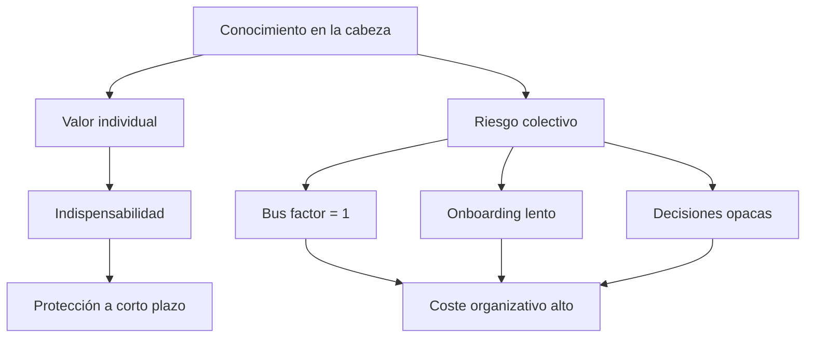
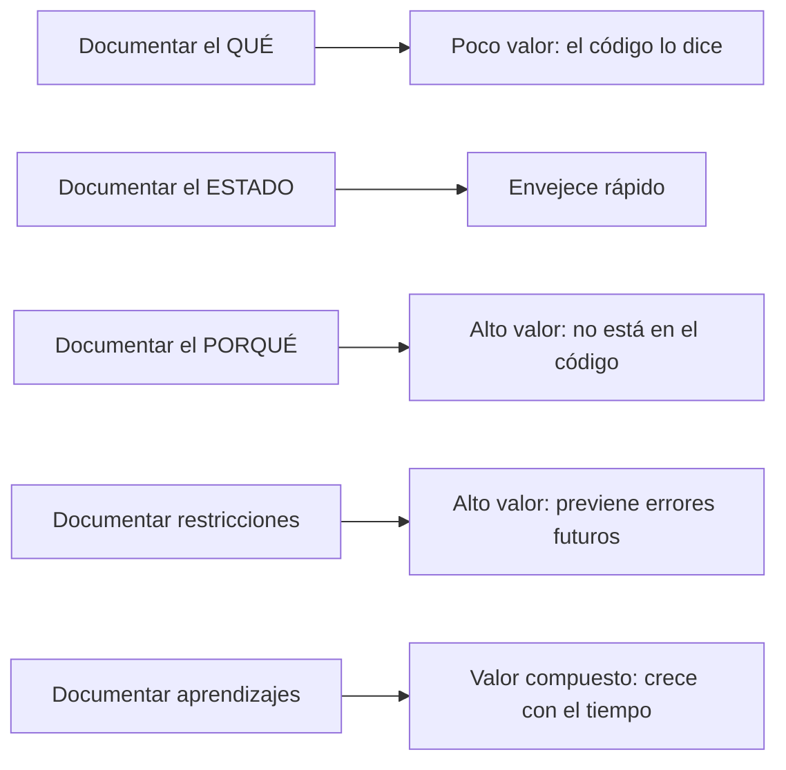

Voy a decir algo incómodo. Y lo digo como opinión, no como verdad universal — aunque creo que quien lo haya vivido lo reconocerá.

En muchos casos, la razón por la que los técnicos no documentaban no era que no tuvieran tiempo. Era que el conocimiento guardado en la cabeza les daba poder. Y documentarlo significaba, en alguna medida, renunciar a él.

No siempre fue consciente. No aplica a todo el mundo ni a todas las situaciones. Hubo —y hay— gente que genuinamente no documentaba por falta de tiempo real, por hábito ausente, por no saber cómo hacerlo bien. Esas razones son legítimas.

Pero también existía la otra. Y merece nombrarse.

---

## Las excusas que todos conocemos

"No hay tiempo." "El código se documenta a sí mismo." "Si lo escribo se queda desactualizado de todas formas." "Es más eficiente preguntarme directamente."

Son excusas que he escuchado durante años. Que yo mismo he usado.

Y aquí voy a ser honesto: en muchas ocasiones era simplemente pereza. No había cálculo de poder detrás, no había estrategia consciente. Era que documentar bien requiere salir del modo de ejecución, estructurar el pensamiento, ponerse en el lugar del lector — y en ese momento yo quería seguir escribiendo código, no explicándolo.

Eso también es real. Y merece nombrarse igual que lo otro.

Dicho eso, la pereza tiene una solución diferente al miedo. Y no confundirlos importa, porque el remedio no es el mismo.

Pero debajo de algunas de esas excusas — no todas, pero sí más de las que nos gusta admitir — hay algo que no se dice:

**El técnico que sabe cosas que nadie más sabe es indispensable.** El que tiene el sistema en la cabeza es el que no puedes despedir, el que convocas a las tres de la mañana cuando hay un incidente, el que decide sin pedir permiso porque es el único que puede. Eso tiene valor. Y documentar erosiona ese valor.

No es malicia. Es incentivo. Durante décadas, en muchas organizaciones, el conocimiento retenido fue una estrategia de supervivencia perfectamente racional.

---

## El precio que pagó el equipo

Lo que esa estrategia no calculaba, o prefería ignorar, es el coste que asumía el resto.

El nuevo en el equipo que tardaba seis meses en ser productivo porque nadie le explicó cómo estaba montado el sistema. El compañero que tocaba algo que no debía tocar y rompía producción porque no había ningún documento que dijera por qué aquella decisión estaba tomada así. El proyecto que se bloqueaba cuando el experto se ponía enfermo, o se iba, o simplemente estaba de vacaciones.

El conocimiento retenido en personas no es un activo. Es una deuda que paga el equipo, no el que la genera.

El bus factor — el número de personas que tienen que ser atropelladas por un autobús para que el proyecto muera — es el indicador más honesto de la salud de un equipo. Y un equipo donde nadie documenta tiene, casi por definición, un bus factor de uno.

---

## Por qué la desidia no es la única explicación

Quiero ser justo. No todo era estrategia de poder. Mucho era simplemente pereza, inercia y falta de hábito.

Documentar bien cuesta. Requiere salir del modo de ejecución, ponerse en el lugar del lector, articular lo que está implícito. Para alguien que lleva años haciendo eso de forma inconsciente, hacer el proceso explícito se siente extraño y lento.

Y no había feedback. Escribías algo en Confluence, lo olvidabas, nadie te decía si había servido para algo, la documentación envejecía en silencio. El esfuerzo se evaporaba sin dejar rastro visible.

Sin retorno claro, el comportamiento se extingue. Es así de simple.

El problema no era solo que algunos retuvieran conocimiento por protección. Era que el sistema no recompensaba compartirlo.

---

## Lo que los agentes IA han cambiado

La inteligencia artificial no ha resuelto el problema cultural. Pero lo ha hecho urgente de una forma que ningún discurso sobre "trabajo en equipo" había conseguido.

Un agente IA no puede pedirte que le expliques. No puede llamarte a las tres de la mañana. No puede deducir las reglas no escritas del equipo. Si no están documentadas, para él no existen.

Y el resultado es inmediato y personal: el agente trabaja mal, produce código que viola las convenciones del proyecto, repite los mismos errores. Tú lo sufres directamente. En la misma sesión.

Por primera vez, la falta de documentación tiene un coste que pagas tú, no el nuevo del equipo que llega en seis meses.

Eso cambia el incentivo. Y cuando cambia el incentivo, cambia el comportamiento.

---

## Pero saber que hay que documentar no es suficiente

Aquí está el error que cometemos cuando finalmente nos convencemos de la importancia de documentar: pensamos que el problema era la motivación, y que con motivación ya está resuelto.

No está resuelto. Porque la mayoría de la documentación que produce un equipo convencido de su importancia sigue siendo documentación inútil.

Documentación que describe el qué, cuando el código ya lo dice. Documentación de estado que envejece en días. Documentación aspiracional que refleja cómo queremos que sea el sistema, no cómo es. Documentación larga, dispersa, sin estructura, que nadie puede consumir en dos minutos.

Lo que los agentes IA nos están enseñando, a la fuerza, es que **documentar bien es una disciplina técnica**. Tiene sus patrones, sus formatos, sus principios.

El qué está en el código. El porqué, las restricciones y los aprendizajes no están en ningún sitio salvo que alguien los escriba. Y eso es lo que tiene valor.

---

## El formato importa tanto como el contenido

Un documento de arquitectura que nadie lee en menos de cinco minutos no sirve. Un documento que hay que actualizar en diez sitios cada vez que cambia algo no sirve. Un documento que mezcla estado actual con decisiones históricas con aspiraciones futuras no sirve.

Lo que sirve es lo que aprendemos a hacer cuando el receptor es un agente:

**Corto.** Un ARCH.md de 40 líneas que se puede leer en dos minutos. No un wiki de 200 páginas.

**Decisiones, no descripciones.** Por qué se eligió esto, no qué hace esto.

**Restricciones explícitas.** Lo que no se puede hacer, y por qué. No solo lo que se debe hacer.

**Acumulativo.** El [ratchet](ratchet-efecto-memoria-agente.md): cada error corregido se documenta como regla. El documento solo crece hacia adelante.

Estos principios no son nuevos. Los buenos arquitectos los conocían. Lo que la IA ha hecho es volverlos obligatorios.

---

## El cambio cultural que nadie pidió pero que estaba pendiente

La IA generativa ha forzado en meses una conversación que las organizaciones llevan décadas aplazando.

El conocimiento retenido en personas es frágil, inequitativo e ineficiente. Siempre lo fue. Lo que faltaba era un incentivo lo suficientemente inmediato y personal para que los técnicos lo sintieran en carne propia.

Ese incentivo llegó en forma de agente que falla porque no tiene contexto. Que repite errores porque nadie le dejó la regla por escrito. Que genera código inconsistente porque el arquitecto tenía el sistema en la cabeza pero no en ningún documento.

No se puede proteger el conocimiento de una herramienta que trabaja contigo en tiempo real. O lo documentas, o trabajas solo. Y trabajar solo con herramientas que podrían multiplicar tu capacidad es el desperdicio más caro que existe ahora mismo en ingeniería de software.

La elección ya no es entre documentar y no documentar. Es entre documentar bien o perder la ventaja que la IA podría darte.

---

> Artículos relacionados: [[01 Artículos/documentar-ahora-es-diferente|Documentar ahora es diferente]] · [[04 Arquitectura IA/documento-arquitectura-base|ARCH.md: memoria para el agente]] · [[04 Arquitectura IA/ratchet-efecto-memoria-agente|El efecto ratchet]] · [[02 Laboratorios/arch-md-ejemplo|Lab: ARCH.md ejemplo]]

---

## Referencias

- **Andrew Hunt & David Thomas** — *The Pragmatic Programmer* (1999, actualizado 2019). Introduce el concepto de *lottery factor* como medida de la dependencia crítica de conocimiento en un equipo.
- **Martin Fowler** — [*Truck Number*](https://martinfowler.com/bliki/TruckNumber.html), martinfowler.com. Definición y análisis del indicador en contextos de equipo de software.
- **Nicole Forsgren, Jez Humble & Gene Kim** — *Accelerate: The Science of Lean Software and DevOps* (2018). El conocimiento distribuido como predictor de rendimiento organizacional en equipos de alto rendimiento.
- **Matthew Skelton & Manuel Pais** — *Team Topologies* (2019). Diseño de equipos para minimizar dependencias críticas de conocimiento y reducir la carga cognitiva individual.
- **Gene Kim, Kevin Behr & George Spafford** — *The Phoenix Project* (2013). Ilustración narrativa de cómo el conocimiento retenido en una sola persona puede paralizar una organización entera.
