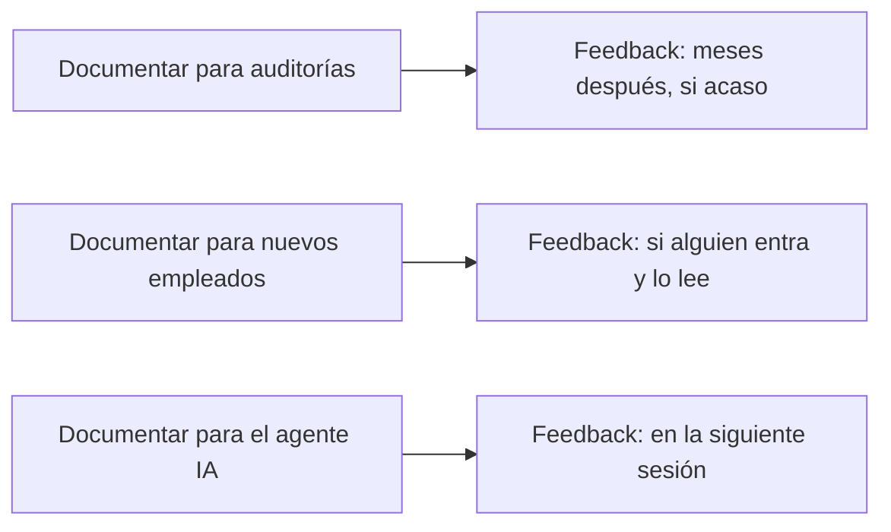

Durante años la documentación fue lo que hacíamos cuando ya no había nada más importante que hacer. Que era casi nunca.

Lo entiendo. Vengo de ese lugar. Eres técnico, tienes el sistema en la cabeza, sabes exactamente cómo funciona cada pieza. Escribirlo para que otro lo entienda se siente redundante. Lento. Burocrático. Una deuda con el pasado que alguien más pidió y nadie va a leer.

Lo que no veíamos entonces es que el problema no era la documentación. Era para quién la escribíamos.

---

## El argumento que siempre perdíamos

La conversación era siempre la misma. Project manager o arquitecto jefe pide documentación. El equipo técnico protesta. Se llega a un acuerdo incómodo: se documenta lo mínimo, tarde, mal.

Nadie ganaba. Y en el fondo, el equipo técnico tenía parte de razón.

La documentación que se pedía era documentación para auditorías, para nuevos empleados hipotéticos, para justificar decisiones ante stakeholders. Era documentación que describía lo que ya estaba en el código. Era documentación que envejecía mal y que nadie actualizaba porque actualizarla no movía ningún indicador que importara.

Si vas a escribir algo que nadie va a leer y que va a estar desactualizado en tres meses, sí — es una pérdida de tiempo.

Ese argumento era correcto. El problema era que la premisa era falsa.

---

## Lo que cambió

Ahora trabajo con agentes IA en proyectos reales. Y lo primero que descubrí es que el agente no recuerda nada.

Cada sesión empieza de cero. Sin contexto de las decisiones que tomé la semana pasada. Sin entender por qué la lógica de negocio está donde está. Sin saber qué convenciones usa el equipo. Sin memoria de los errores que cometió en las tres sesiones anteriores.

Si no le doy esa información explícitamente, el agente toma decisiones propias. Y esas decisiones son genéricas, razonables en abstracto, e incorrectas para mi proyecto específico.

La solución es documentar. No para un auditor. No para un nuevo empleado hipotético. Para el sistema que trabaja conmigo ahora mismo.

Y ahí cambia todo.

---

## Por qué ahora es natural lo que antes era forzado

Cuando documentas para un auditor, el incentivo es difuso. El auditor llegará en seis meses, si llega. El documento puede estar desactualizado para entonces. Nadie te va a felicitar por haberlo mantenido al día.

Cuando documentas para tu agente IA, el feedback es inmediato.

Escribes la regla en `ARCH.md`. En la siguiente sesión, el agente la aplica. No comete el error que venía cometiendo. La calidad del output mejora. Sientes el efecto directamente.

El incentivo cambió. Ya no es un acto de disciplina profesional que produce resultados vagos en el futuro. Es una inversión con retorno medible en minutos.

---

## El tipo de documentación que ahora importa

No toda la documentación importa por igual. Lo que los agentes necesitan es específico:

**Decisiones, no descripciones.** El código ya describe lo que hace el sistema. Lo que el agente no puede inferir del código es por qué está hecho así. Qué alternativas se descartaron. Qué restricciones impusieron ciertas elecciones.

**Restricciones, no aspiraciones.** "Queremos tener una arquitectura limpia" no le dice nada al agente. "La lógica de negocio reside exclusivamente en `domain/`. Si la pones en `api/`, el código se rechaza en revisión" sí le dice algo concreto y verificable.

**Aprendizajes acumulados, no estado actual.** El estado actual lo puede leer del código. Lo que no puede leer es la historia de errores que llevaron a las reglas actuales. Esa historia, documentada en el ratchet, es lo más valioso.

---

## Lo que los técnicos siempre supimos y ahora podemos demostrar

Siempre hubo algo que los buenos técnicos hacían de forma natural: mantener el contexto en la cabeza. Sabían exactamente el estado del sistema, las decisiones tomadas, los tradeoffs aceptados. No necesitaban documentarlo porque lo llevaban encima.

El problema era que ese conocimiento moría cuando la persona se iba. O cuando volvía después de tres meses de vacaciones. O simplemente cuando el proyecto crecía más de lo que una mente puede sostener.

Los agentes IA hacen visible ese problema de forma brutal y urgente. No tienen cabeza donde llevar el contexto. Si no está escrito, no existe para ellos.

Pero también revelan algo positivo: los técnicos siempre supimos qué tipo de conocimiento importaba. Decisiones, restricciones, aprendizajes. Nunca nos gustó documentar el qué — teníamos razón, el código ya lo dice. Lo que cambia ahora es que también tenemos que documentar el por qué y el qué no.

Y eso, curiosamente, es lo más interesante de escribir.

---

## El cambio real no es técnico

El cambio de fondo no es que los agentes IA necesiten documentación. El cambio es que por primera vez el retorno de documentar bien es inmediato, medible y personal.

Ya no documentas para la organización. Documentas para tu herramienta de trabajo. Y tu herramienta de trabajo te lo devuelve en la misma sesión.

Eso transforma el hábito. Lo que antes requería disciplina ahora tiene su propio ciclo de refuerzo. Lo que antes era burocracia ahora es ingeniería del contexto.

La documentación no cambió. Cambió para quién la escribes. Y con eso, cambió todo lo demás.

---

> Relacionado: [[04 Arquitectura IA/documento-arquitectura-base|ARCH.md: el documento que le da memoria a tu agente]] · [[04 Arquitectura IA/ratchet-efecto-memoria-agente|El efecto ratchet]]
