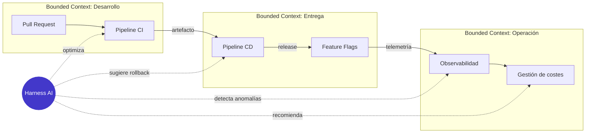
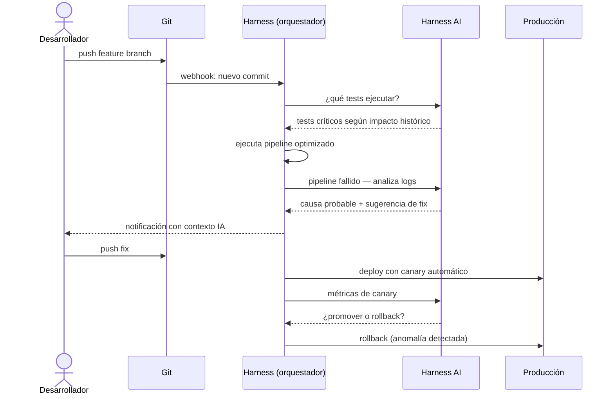
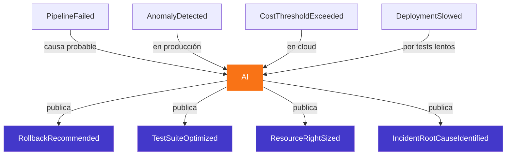
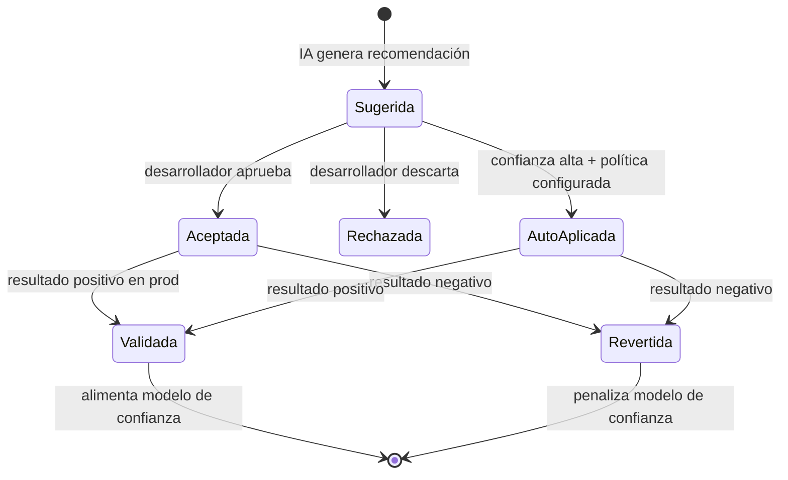

Cuando el mundo de la IA generativa comenzó a invadir las herramientas de desarrollo, la mayoría de los análisis vinieron del lado técnico: modelos, tokens, benchmarks. Harness AI llega con otra promesa — integrarse en el ciclo de vida del software — y merece ser leída desde la óptica de alguien que piensa en términos de dominio, contextos y flujos de negocio.

## Qué propone Harness AI

Harness no es un modelo ni un copiloto de código. Es una plataforma de ingeniería de software (CI/CD, feature flags, observabilidad, gestión de costes cloud) que ha empezado a incorporar IA en cada uno de sus módulos: desde sugerencias de pipelines hasta análisis automático de incidentes.

El arquitecto DDD lo lee así: Harness intenta ser el **dominio de orquestación** entre el código y la producción, y la IA actúa como un servicio de aplicación que enriquece cada bounded context del ciclo de entrega.

## La propuesta desde DDD: IA como servicio de aplicación

En DDD clásico, los servicios de aplicación orquestan casos de uso sin contener lógica de negocio. Harness AI encaja bien en ese rol: no decide qué hace tu pipeline, sugiere y automatiza. La lógica de negocio (qué tests son críticos, qué regiones son prioritarias para el deploy) sigue siendo tuya.

Esto importa porque muchas propuestas de IA en DevOps cometen el error de querer ser el dominio en vez de servir al dominio.

## Domain Events que Harness AI debería emitir

Uno de los problemas de las plataformas de DevOps es que sus eventos son técnicos, no de dominio. Si Harness AI razona sobre el ciclo de entrega, sus eventos deberían tener semántica de negocio:

La diferencia entre `PipelineFailed` y `RollbackRecommended` es exactamente la que separa un evento técnico de un evento de dominio. Harness AI está en posición de hacer esa traducción — si su diseño lo permite.

## El problema de la confianza como concepto de dominio

Desde DDD, la confianza en las sugerencias de la IA no es un detalle de UI — es un concepto de dominio que necesita modelarse explícitamente.

Sin este ciclo de feedback modelado, la IA de la plataforma no aprende del contexto de tu organización — uno de los déficits comunes en las implementaciones actuales.

## Lo que el Arquitecto DDD le pediría a Harness

| Pregunta | Expectativa |
|----------|-------------|
| ¿Dónde están mis bounded contexts? | Que la plataforma los reconozca como límites de configuración |
| ¿Mis domain events viajan por el sistema? | Webhooks con semántica de negocio, no solo técnica |
| ¿Puedo ajustar el modelo de confianza? | Política configurable por equipo/servicio |
| ¿La IA conoce mi ubiquitous language? | Integración con el lenguaje del equipo, no genérico |
| ¿Hay trazabilidad de decisiones IA? | Log de razonamiento, no solo de acción |

## Conclusión

Harness AI es una apuesta interesante precisamente porque no intenta ser una IA de propósito general. Su valor está en el dominio específico del ciclo de entrega de software. Desde DDD, eso es una ventaja enorme: un modelo de IA que sabe dónde está, qué vocabulario usar y qué eventos le importan es un modelo que puede integrarse sin romper las fronteras de contexto que el equipo ha construido.

El riesgo, como siempre, es que la plataforma optimice para la métrica fácil (velocidad de pipelines) y no para el problema de negocio (confianza en el release). Esa distinción es exactamente la que el pensamiento DDD lleva décadas intentando enseñar.

---

> Este artículo explora la propuesta de Harness AI desde una perspectiva arquitectónica de DDD. No es un análisis técnico de la implementación interna de sus modelos.
