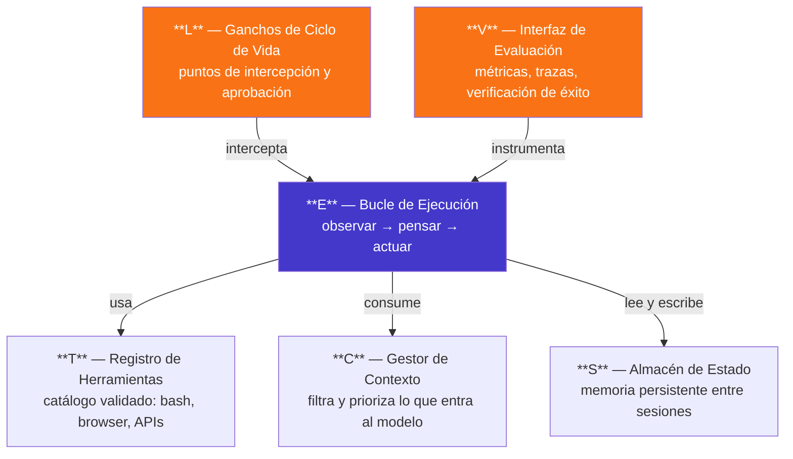
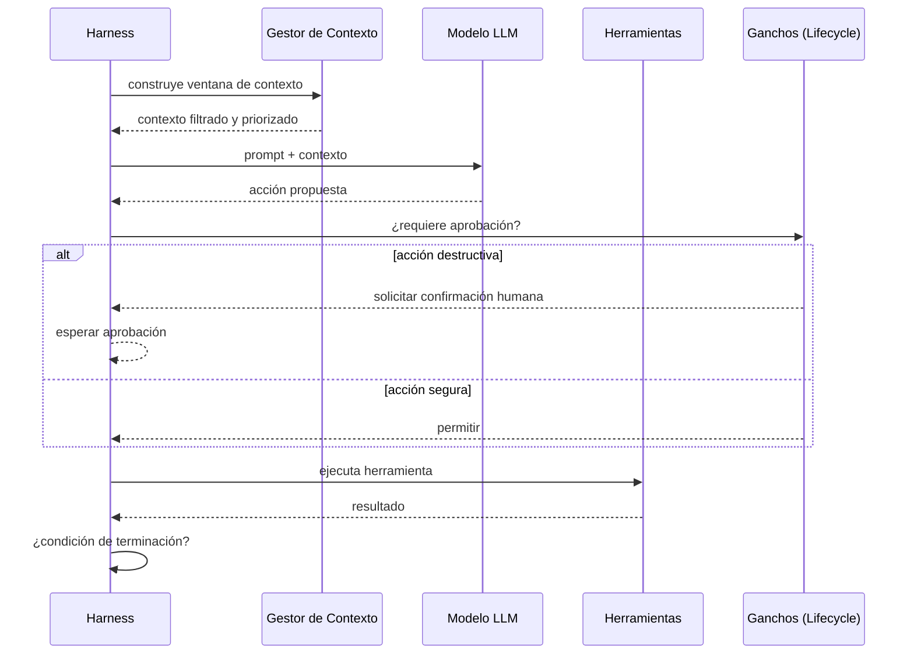
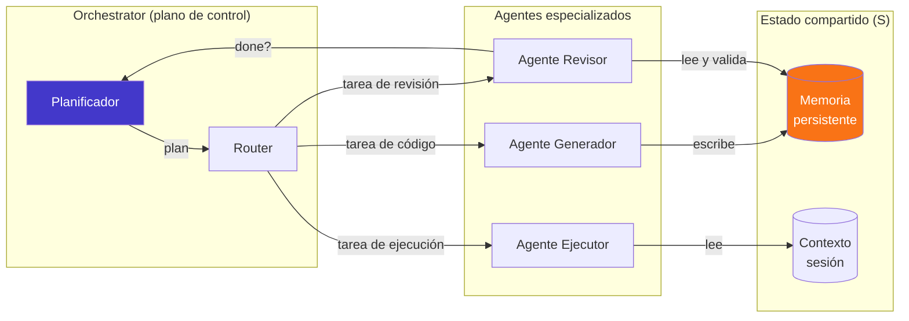
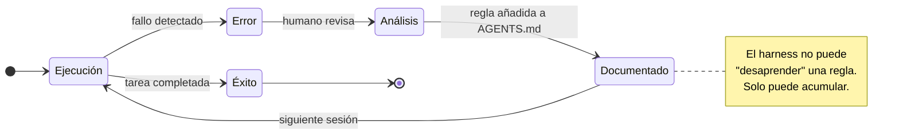
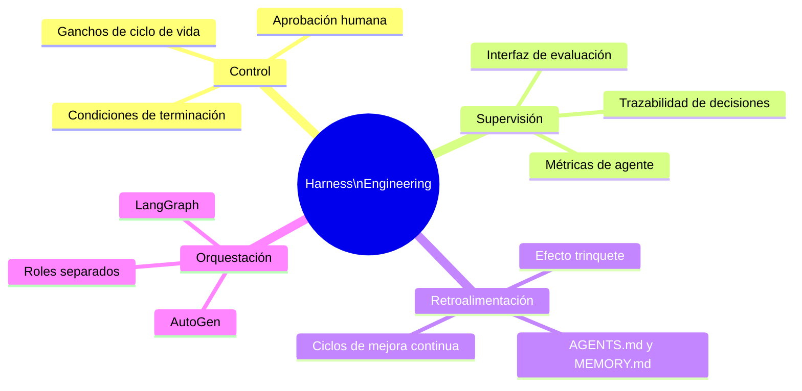

Hay un cambio de paradigma en marcha que la mayoría de los debates sobre IA generativa están ignorando. No se trata del modelo. Se trata de lo que lo rodea.

**Harness engineering** — ingeniería de arneses — es la disciplina que emerge cuando los equipos descubren que desplegar un LLM en producción no es conectar una API, sino diseñar un sistema completo de control, supervisión y retroalimentación alrededor de él.

El trabajo del ingeniero se desplaza. Ya no es entrenar ni afinar modelos. Es **arquitectar comportamientos**.

---

## Qué es un harness y por qué importa

Un harness no es el modelo. Es todo lo demás: el ecosistema de software y reglas que controla cómo el agente observa, razona y ejecuta tareas de manera confiable en producción.

Formalmente, un harness se define como seis componentes interdependientes:

$$H = (E, T, C, S, L, V)$$



Cada componente resuelve un problema distinto. La mayoría de los proyectos que fallan en producción lo hacen porque ignoraron **L** (no hay supervisión humana en los momentos críticos) o **V** (no hay forma de saber si el agente está haciendo lo correcto).

---

## El ciclo que el modelo no ve

El bucle observe-think-act es la unidad de trabajo de cualquier agente. El harness es el que decide cuándo continuar, cuándo pedir aprobación y cuándo detener.



La clave está en los ganchos (**L**). Sin ellos, el agente ejecuta acciones irreversibles sin supervisión. Con ellos, el arquitecto define exactamente qué nivel de autonomía se otorga y en qué condiciones.

---

## Orquestación multi-agente: LangGraph y AutoGen

Cuando el problema supera las capacidades de un solo agente, entra la orquestación multi-agente. Frameworks como **LangGraph** y **AutoGen** implementan esta capa mediante grafos de estados y agentes especializados que comparten contexto.



La separación de roles no es opcional: el **Agente Generador** produce, el **Agente Revisor** valida contra la condición de terminación antes de que el orquestador avance. Sin este ciclo, los errores se propagan sin fricción.

---

## Markdown como infraestructura del harness

Aquí está el giro práctico más importante: gran parte de las políticas del harness —el contexto (**C**) y el estado (**S**)— se implementan en archivos Markdown planos en la raíz del repositorio.

Herramientas como Claude Code, Cursor o los flujos de trabajo de Mitchell Hashimoto convergen en el mismo patrón: `AGENTS.md` y `MEMORY.md`.

```
repositorio/
├── AGENTS.md       ← políticas, restricciones, roles
├── MEMORY.md       ← aprendizajes persistentes entre sesiones
└── src/
```

### El efecto trinquete

El principio de diseño es el **efecto trinquete** (*ratchet*): cada vez que el agente comete un error, la solución se documenta en el Markdown. El harness no puede volver atrás — cada aprendizaje se acumula.



### Estructura de un AGENTS.md

```markdown
# AGENTS.md

## Contexto y Estado (C, S)
- La lógica de estado reside exclusivamente en la capa de servicios.
- Nunca comentar tests que fallan — repararlos o eliminarlos.
- Usar siempre `src/utils/logger.ts`, nunca `console.log`.

## Restricciones de Herramientas (T, E)
- Bloqueado: `rm -rf`, `git push --force`, `DROP TABLE`.
- Antes de PR: ejecutar `npm run typecheck && npm run lint`.

## Orquestación Multi-Agente (L)
- Agente Generador escribe código.
- Agente Revisor valida la done-condition antes de avanzar.
- Aprendizajes de sesión → registrar en MEMORY.md.
```

---

## El cambio de paradigma para el arquitecto

La IA generativa tradicional pedía al arquitecto que eligiera el modelo correcto. La ingeniería de arneses le pide algo diferente: **diseñar el sistema de comportamientos** que hace que ese modelo sea confiable en producción.



Los sectores financiero y de desarrollo de software que ya operan con estos sistemas comparten una lección: el modelo importa menos de lo que se cree. Lo que marca la diferencia es la calidad del harness.

---

## Conclusión

**La autonomía de un agente no es una propiedad del modelo, es una propiedad del harness.**

Cuanto mejor diseñado esté el sistema de control que rodea al LLM —sus ganchos, su gestión de contexto, su almacén de estado, su interfaz de evaluación— mayor y más segura puede ser la autonomía que se le otorga.

El arquitecto que entiende esto no pregunta "¿qué modelo uso?" sino "¿qué comportamientos necesito garantizar y cómo los encuadro?". Esa es exactamente la pregunta correcta.

---

> Artículo basado en el análisis de 40 fuentes sobre *Harness Engineering and the Evolution of Agentic Workflows* (6 mayo 2026). Los diagramas son elaboración propia a partir de los conceptos del corpus.
