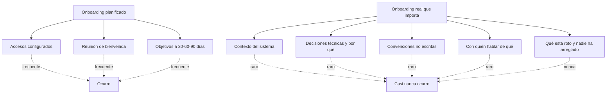
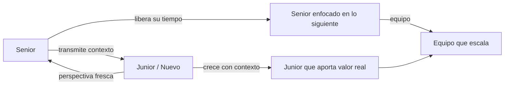

Todos hemos sido nuevos alguna vez.

Lo recuerdo. La primera semana en un equipo desconocido. El repositorio sin README útil. Las decisiones técnicas que "se explican solas si lees el código". Las reuniones donde todo el mundo habla de conceptos que nadie te explicó. La sensación de que interrumpir con preguntas básicas te hace quedar mal, así que no interrumpes. Y no aprendes.

Ese no es un recuerdo de hace veinte años. Es la realidad de la mayoría de los equipos técnicos hoy.

---

## El onboarding que existe en papel

Muchas organizaciones tienen onboarding. Tienen documento de bienvenida, tienen checklist de accesos, tienen reunión con RRHH el primer día. Algunos hasta tienen plan de 30-60-90 días con objetivos.

Y aun así, el nuevo llega, abre el repositorio, y no sabe por dónde empezar.

Porque el onboarding que existe en papel no es el onboarding que importa. El que importa es el que te da el contexto real del sistema: por qué está montado así, qué decisiones se tomaron y por qué, qué no debes tocar y por qué, qué convenciones usa el equipo que no están escritas en ningún sitio.

Ese onboarding, en la mayoría de los equipos, no existe. Y si existe, vive en la cabeza de dos o tres personas que no tienen tiempo o no tienen el hábito de transmitirlo.

---

## Lo que eso le cuesta al nuevo

La persona que entra motivada, con experiencia, con ganas de aportar, se encuentra con un sistema que no puede entender en semanas porque nadie le dio el mapa.

No es falta de capacidad. Es falta de contexto.

Y la consecuencia es predecible: los primeros meses rinde por debajo de su potencial. Se frustra porque no puede tomar decisiones autónomas. Pregunta y le dicen que pregunte a otra persona. Esa otra persona está ocupada. Aprende por ensayo y error, que es la forma más lenta y costosa de aprender en un sistema en producción.

Lo que debería tardar dos semanas tarda seis meses. Y en esos seis meses, la persona ya ha formado una opinión sobre el equipo, sobre la organización, sobre si quiere quedarse.

Los mejores se van antes. No por el salario. Por la fricción.

---

## Lo que le cuesta a la organización

El cálculo que las organizaciones no hacen: ¿cuánto vale un perfil senior que trabaja al 30% durante seis meses porque no tiene contexto?

Si ese perfil tiene un coste de 6.000€ al mes, y trabaja al 30% de su capacidad durante cinco meses, la organización está dejando de obtener el 70% de ese valor — unos 21.000€ en productividad no generada — antes de que esa persona haya podido contribuir de verdad.

Y eso sin contar el coste de la rotación si se va antes de recuperar la inversión de contratarlo.

El onboarding roto no es un problema blando. Es un problema financiero con un número detrás que casi nunca se calcula porque es incómodo de ver.

---

## Ni la persona ni la organización saben qué se espera

Hay un problema aún más profundo que el contexto técnico.

En muchos casos, ni el nuevo sabe qué se espera de él, ni la organización tiene claridad sobre qué necesita de esa persona. Se contrató porque "necesitamos un senior de backend" pero nadie definió qué significa el éxito a los tres meses. Ni a los seis.

El nuevo hace lo que puede. El equipo observa. Nadie da feedback explícito. Nadie dice "esto está bien, esto no está bien, esto es lo que necesitamos de ti". Se asume que el senior experimentado lo deducirá solo.

A veces lo deduce. Muchas veces no. Y en los equipos donde el conocimiento está retenido, la deducción es imposible porque la información no está disponible.

---

## Lo que un buen senior hace distinto

Lo que más me enorgullece cuando trabajo con alguien que acaba de llegar no es que aprenda rápido. Es que llegue un momento donde sepa tanto o más que yo en alguna área.

Cuando eso ocurre, mi trabajo está hecho.

No es humildad performativa. Es que un equipo donde el conocimiento fluye y se multiplica es estructuralmente más robusto que uno donde se concentra. Cuando alguien sabe lo que yo sé, puedo descansar, puedo cambiar de proyecto, puedo enfocarme en lo siguiente. Cuando soy el único que sabe algo, soy el cuello de botella de todo.

El senior que acumula conocimiento sin transmitirlo no está protegiendo su posición. Está limitando la del equipo. Y la suya propia, aunque no lo parezca.

El aprendizaje es bidireccional. El que llega nuevo trae perspectiva que el que lleva años ha perdido. La pregunta "¿por qué está hecho así?" que incomoda al equipo es a veces la pregunta más valiosa que alguien puede hacer. Y solo la hace alguien que aún no ha asumido que las cosas son como son porque siempre fueron así.

Escuchar eso no es una amenaza. Es información.

---

## La documentación como acto de liderazgo

El onboarding que no existe se construye con documentación. No con reuniones de bienvenida ni con checklists de accesos.

Un ARCH.md bien mantenido, un README honesto, una sección de decisiones con su razonamiento. Eso es lo que le da al nuevo el mapa que nadie le va a explicar en una reunión porque nadie tiene tiempo de repetirlo cada vez que alguien entra.

Documentar el contexto del sistema es, literalmente, escribir el onboarding que el siguiente que llegue va a necesitar.

Y tiene un efecto secundario: obliga al equipo a articular lo que asume como obvio. Muchas cosas que parecen obvias porque "siempre fue así" dejan de parecerlo cuando tienes que escribirlas. Ahí está la revisión más útil que un equipo puede hacerse.

---

## Lo que hay que exigir

Si formas parte de un equipo técnico, esto es lo mínimo que el nuevo merece desde el primer día:

- Un documento que explique el sistema real, no el ideal
- Las decisiones que se tomaron y por qué, especialmente las que no son obvias
- Lo que no funciona bien y por qué no se ha arreglado
- Con quién hablar de qué
- Las expectativas explícitas a 30, 60 y 90 días

Nada de esto requiere presupuesto. Requiere que alguien lo escriba. Y que la organización lo trate como parte del trabajo, no como algo que se hace cuando hay tiempo.

Porque cuando hay tiempo, ya es tarde. El nuevo ya se fue o ya se resignó.

---

> Este artículo forma parte de una serie sobre conocimiento, documentación y organizaciones técnicas:
> [[01 Artículos/coste-conocimiento-retenido-organizaciones|El coste oculto del conocimiento retenido]] · [[01 Artículos/documentacion-poder-conocimiento|El conocimiento que no se documenta no se comparte]] · [[02 Laboratorios/arch-md-ejemplo|Lab: ARCH.md ejemplo]]
