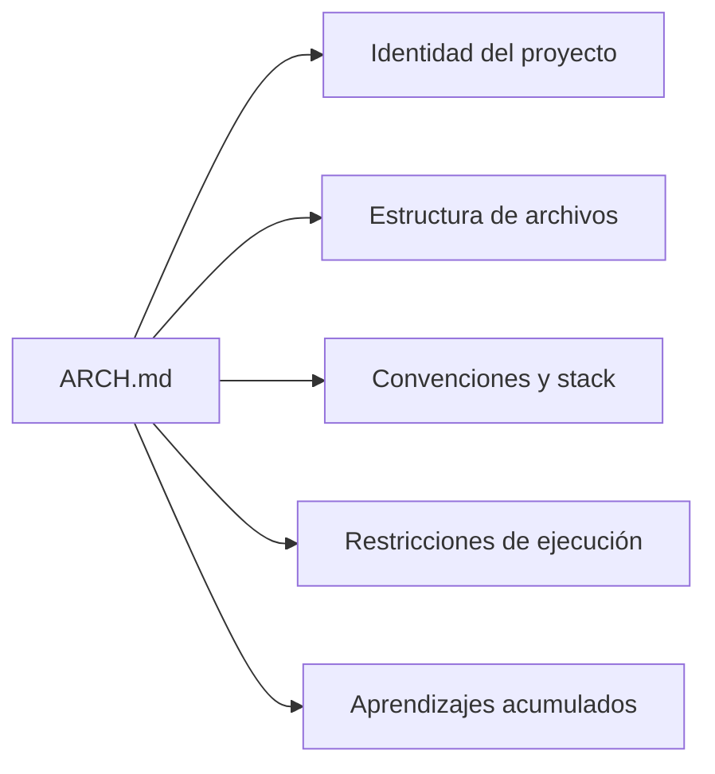
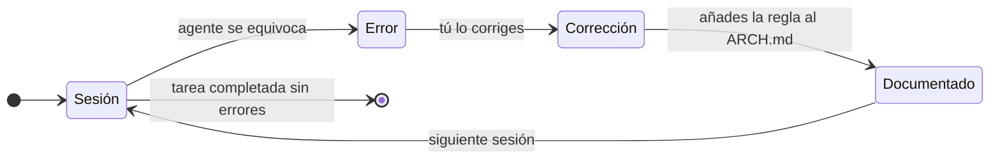

Un agente IA no recuerda nada entre sesiones. Sin un documento de referencia, cada conversación empieza de cero y el agente toma decisiones que contradicen las de la sesión anterior.

El `ARCH.md` resuelve esto: es el archivo que vive en la raíz del repositorio y que el agente lee antes de actuar. No es documentación — es el contrato operativo del proyecto.

---

## Estructura del documento

Un `ARCH.md` efectivo tiene cinco bloques:



Cada bloque responde a una pregunta distinta que el agente necesita tener resuelta antes de actuar.

---

## Ejemplo genérico comentado

```markdown
# ARCH.md

> Este archivo es el contrato operativo del proyecto.
> Todo agente que trabaje aquí debe leerlo antes de actuar.

---

## 1. Qué es este proyecto
<!-- Responde: ¿dónde estoy? ¿qué hago aquí? -->

API REST para gestión de pedidos de una tienda B2B.
Stack: Node.js 20 + TypeScript + PostgreSQL + Redis.
Rama principal: main. Entorno de producción: AWS ECS.
CI/CD: GitHub Actions → ECR → ECS Blue/Green.

---

## 2. Estructura de carpetas
<!-- Responde: ¿dónde va cada tipo de archivo? -->

src/
├── domain/          ← lógica de negocio pura, sin dependencias externas
├── application/     ← casos de uso, orquesta el dominio
├── infrastructure/  ← adaptadores: DB, cache, HTTP, mensajería
├── api/             ← controladores Express, validación de entrada
└── shared/          ← tipos, constantes, utilidades transversales

tests/
├── unit/            ← tests de dominio y aplicación (sin I/O)
└── integration/     ← tests con base de datos real (Docker Compose)

---

## 3. Convenciones
<!-- Responde: ¿cómo se hace aquí cada cosa? -->

- La lógica de negocio reside en `domain/`. Nunca en `api/` ni `infrastructure/`.
- Los errores de dominio son clases explícitas, no strings ni códigos HTTP.
- Usar `logger` de `src/shared/logger.ts`. Nunca `console.log` directo.
- Nombres en inglés para código, español para comentarios de dominio.
- Antes de PR: `npm run typecheck && npm run test && npm run lint`.

---

## 4. Restricciones de ejecución
<!-- Responde: ¿qué no debo hacer nunca? -->

- Nunca ejecutar migraciones de base de datos sin confirmación explícita.
- Nunca modificar archivos en `infrastructure/db/migrations/` generados.
- Nunca hacer `git push --force` a `main`.
- Nunca comentar tests que fallan — arreglarlos o eliminarlos.

---

## 5. Aprendizajes acumulados
<!-- Esta sección solo crece. Nunca se borra una entrada. -->

- 2026-03-10 — No usar `any` en TypeScript aunque compile:
  el type checker pierde valor y los errores aparecen en runtime.
- 2026-04-02 — Las migraciones deben ser idempotentes.
  El pipeline las ejecuta en cada deploy; si no son idempotentes, fallan.
- 2026-05-01 — Los tests de integración necesitan `afterEach` para limpiar
  la base de datos. Sin limpieza, los tests se contaminan entre sí.
```

---

## Qué hace a un ARCH.md efectivo

### Describe decisiones, no aspiraciones

Escribe lo que el proyecto **es**, no lo que quieres que sea. Un agente que lee "usamos Clean Architecture" en un proyecto que en realidad mezcla capas va a generar código basado en esa promesa falsa.

### Las restricciones son tan importantes como las convenciones

Decirle al agente qué no debe hacer es más valioso que decirle qué sí. Las restricciones previenen los errores que más duelen: los irreversibles.

### El ratchet es la parte que más valor acumula con el tiempo



Cada error corregido y documentado es una regla que el agente no volverá a violar. Con el tiempo, el documento se convierte en la memoria colectiva del proyecto.

### Empieza pequeño

| Tamaño | Efecto |
| ------ | ------ |
| < 30 líneas | El agente lo lee siempre, integra todo el contexto |
| 30-80 líneas | Equilibrio óptimo para la mayoría de proyectos |
| > 150 líneas | Riesgo de que el agente pierda foco o ignore partes |

Un `ARCH.md` de 40 líneas honesto y actualizado vale más que uno de 200 líneas aspiracional y desactualizado.

---

## Cómo empezar en 10 minutos

1. Crea `ARCH.md` en la raíz del repositorio.
2. Rellena solo las secciones 1, 2 y 4 (identidad, estructura, restricciones).
3. Deja la sección 5 (aprendizajes) vacía — se llenará sola.
4. En la próxima sesión con el agente, empieza con: *"Lee ARCH.md antes de hacer cualquier cosa."*
5. Cada vez que corrijas un error del agente, añade la lección a la sección 5.

No necesitas que sea perfecto. Necesita que sea honesto.

---

> Ver también: [[04 Arquitectura IA/documento-arquitectura-base|ARCH.md: el documento que le da memoria a tu agente]]
