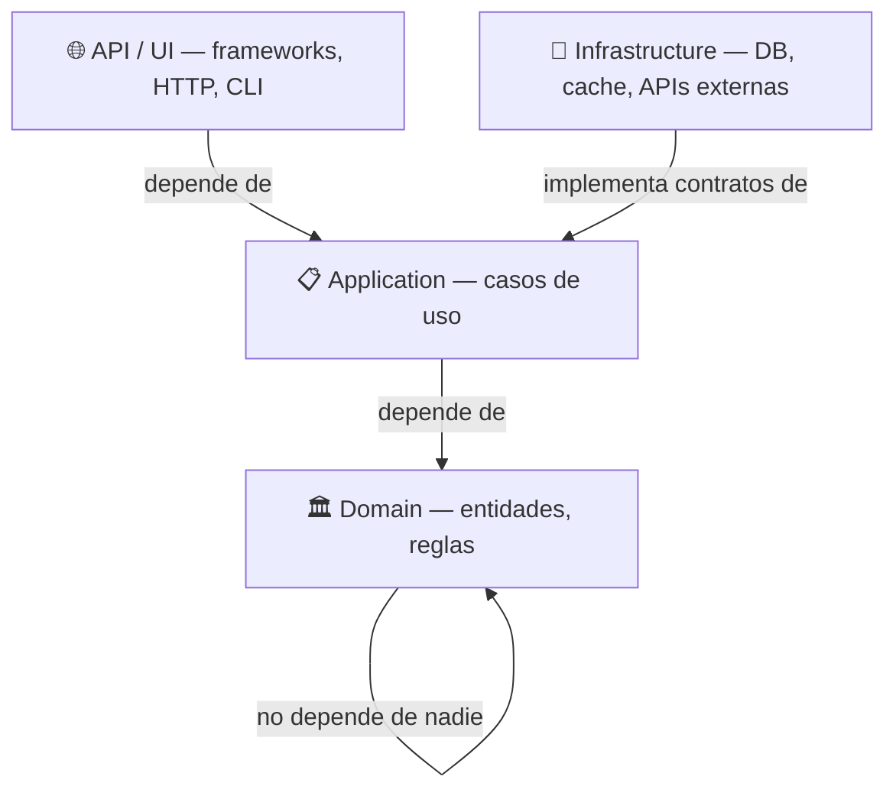
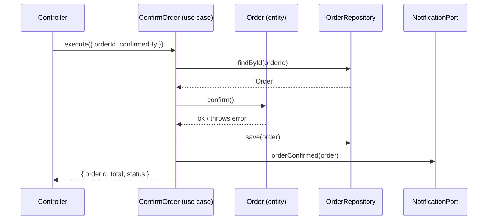

Plantilla base de Clean Architecture para proyectos nuevos. Cópiala, adapta los nombres de dominio y empieza a construir sin debatir la estructura.

---

## La regla fundamental

Las dependencias siempre apuntan hacia dentro. El dominio no conoce nada del exterior.



El dominio es el núcleo. No importa el framework, la base de datos ni el protocolo HTTP — si cambias cualquiera de esas capas, el dominio no se toca.

---

## Estructura de carpetas

```
src/
├── domain/
│   ├── entities/          ← objetos de negocio con lógica propia
│   ├── repositories/      ← contratos (interfaces) de persistencia
│   ├── services/          ← lógica de dominio que no encaja en una entidad
│   └── errors/            ← errores de negocio explícitos
│
├── application/
│   ├── use-cases/         ← un archivo por caso de uso
│   ├── dtos/              ← objetos de transferencia de datos
│   └── ports/             ← contratos hacia infraestructura externa
│
├── infrastructure/
│   ├── persistence/       ← implementaciones de repositorios (Postgres, Mongo…)
│   ├── http/              ← clientes HTTP externos
│   ├── messaging/         ← colas, eventos, pub/sub
│   └── cache/             ← implementaciones de caché
│
├── api/                   ← o `ui/`, `cli/`, según el tipo de app
│   ├── controllers/       ← recibe la petición, llama al caso de uso
│   ├── middlewares/
│   └── routes/
│
└── shared/
    ├── types/             ← tipos transversales
    ├── utils/             ← funciones puras sin estado
    └── logger.ts          ← instancia única de logger
```

---

## Entidad de dominio

```typescript
// src/domain/entities/Order.ts

export type OrderStatus = 'pending' | 'confirmed' | 'shipped' | 'cancelled';

export interface OrderProps {
  id: string;
  customerId: string;
  items: OrderItem[];
  status: OrderStatus;
  createdAt: Date;
}

export interface OrderItem {
  productId: string;
  quantity: number;
  unitPrice: number;
}

export class Order {
  private props: OrderProps;

  constructor(props: OrderProps) {
    this.props = props;
  }

  get id() { return this.props.id; }
  get status() { return this.props.status; }
  get customerId() { return this.props.customerId; }
  get items() { return this.props.items; }

  get total(): number {
    return this.props.items.reduce(
      (sum, item) => sum + item.quantity * item.unitPrice,
      0
    );
  }

  confirm(): void {
    if (this.props.status !== 'pending') {
      throw new OrderAlreadyProcessedError(this.props.id);
    }
    this.props.status = 'confirmed';
  }

  cancel(): void {
    if (this.props.status === 'shipped') {
      throw new OrderCannotBeCancelledError(this.props.id);
    }
    this.props.status = 'cancelled';
  }
}
```

---

## Errores de dominio

```typescript
// src/domain/errors/OrderErrors.ts

export class OrderNotFoundError extends Error {
  constructor(orderId: string) {
    super(`Order ${orderId} not found`);
    this.name = 'OrderNotFoundError';
  }
}

export class OrderAlreadyProcessedError extends Error {
  constructor(orderId: string) {
    super(`Order ${orderId} has already been processed`);
    this.name = 'OrderAlreadyProcessedError';
  }
}

export class OrderCannotBeCancelledError extends Error {
  constructor(orderId: string) {
    super(`Order ${orderId} cannot be cancelled once shipped`);
    this.name = 'OrderCannotBeCancelledError';
  }
}
```

---

## Contrato de repositorio

```typescript
// src/domain/repositories/OrderRepository.ts

import { Order } from '../entities/Order';

export interface OrderRepository {
  findById(id: string): Promise<Order | null>;
  findByCustomer(customerId: string): Promise<Order[]>;
  save(order: Order): Promise<void>;
  delete(id: string): Promise<void>;
}
```

---

## Caso de uso

```typescript
// src/application/use-cases/ConfirmOrder.ts

import { OrderRepository } from '../../domain/repositories/OrderRepository';
import { OrderNotFoundError } from '../../domain/errors/OrderErrors';
import { NotificationPort } from '../ports/NotificationPort';

interface ConfirmOrderInput {
  orderId: string;
  confirmedBy: string;
}

interface ConfirmOrderOutput {
  orderId: string;
  total: number;
  status: string;
}

export class ConfirmOrder {
  constructor(
    private readonly orders: OrderRepository,
    private readonly notifications: NotificationPort,
  ) {}

  async execute(input: ConfirmOrderInput): Promise<ConfirmOrderOutput> {
    const order = await this.orders.findById(input.orderId);

    if (!order) {
      throw new OrderNotFoundError(input.orderId);
    }

    order.confirm();                          // lógica de negocio en la entidad
    await this.orders.save(order);            // persistencia
    await this.notifications.orderConfirmed(order); // notificación

    return {
      orderId: order.id,
      total: order.total,
      status: order.status,
    };
  }
}
```

---

## Puerto de infraestructura

```typescript
// src/application/ports/NotificationPort.ts

import { Order } from '../../domain/entities/Order';

export interface NotificationPort {
  orderConfirmed(order: Order): Promise<void>;
  orderCancelled(order: Order): Promise<void>;
}
```

---

## Implementación de repositorio (infraestructura)

```typescript
// src/infrastructure/persistence/PostgresOrderRepository.ts

import { OrderRepository } from '../../domain/repositories/OrderRepository';
import { Order } from '../../domain/entities/Order';
import { db } from '../db/client';          // detalle de implementación

export class PostgresOrderRepository implements OrderRepository {

  async findById(id: string): Promise<Order | null> {
    const row = await db.query(
      'SELECT * FROM orders WHERE id = $1', [id]
    );
    if (!row) return null;
    return this.toEntity(row);
  }

  async save(order: Order): Promise<void> {
    await db.query(
      `INSERT INTO orders (id, customer_id, status, total)
       VALUES ($1, $2, $3, $4)
       ON CONFLICT (id) DO UPDATE SET status = $3`,
      [order.id, order.customerId, order.status, order.total]
    );
  }

  async findByCustomer(customerId: string): Promise<Order[]> {
    const rows = await db.query(
      'SELECT * FROM orders WHERE customer_id = $1', [customerId]
    );
    return rows.map(this.toEntity);
  }

  async delete(id: string): Promise<void> {
    await db.query('DELETE FROM orders WHERE id = $1', [id]);
  }

  private toEntity(row: any): Order {
    return new Order({
      id: row.id,
      customerId: row.customer_id,
      items: row.items,
      status: row.status,
      createdAt: new Date(row.created_at),
    });
  }
}
```

---

## Controlador (API)

```typescript
// src/api/controllers/OrderController.ts

import { Request, Response } from 'express';
import { ConfirmOrder } from '../../application/use-cases/ConfirmOrder';

export class OrderController {
  constructor(private readonly confirmOrder: ConfirmOrder) {}

  async confirm(req: Request, res: Response): Promise<void> {
    try {
      const result = await this.confirmOrder.execute({
        orderId: req.params.id,
        confirmedBy: req.user.id,
      });
      res.json(result);
    } catch (error) {
      if (error instanceof OrderNotFoundError) {
        res.status(404).json({ error: error.message });
        return;
      }
      res.status(500).json({ error: 'Internal server error' });
    }
  }
}
```

---

## Composición de dependencias

```typescript
// src/api/bootstrap.ts  ← único sitio donde se instancia todo

import { PostgresOrderRepository } from '../infrastructure/persistence/PostgresOrderRepository';
import { EmailNotificationAdapter } from '../infrastructure/messaging/EmailNotificationAdapter';
import { ConfirmOrder } from '../application/use-cases/ConfirmOrder';
import { OrderController } from './controllers/OrderController';

// infraestructura
const orderRepository = new PostgresOrderRepository();
const notificationAdapter = new EmailNotificationAdapter();

// caso de uso
const confirmOrder = new ConfirmOrder(orderRepository, notificationAdapter);

// controlador
export const orderController = new OrderController(confirmOrder);
```

---

## Flujo completo



---

## Reglas de oro

| Regla | Por qué |
| ----- | ------- |
| El dominio no hace `import` de infraestructura | Si lo hace, un cambio de DB rompe las reglas de negocio |
| Los errores de dominio son clases, no strings | Permiten `catch` tipado y mensajes consistentes |
| Un caso de uso = un archivo | Fácil de encontrar, testear y cambiar |
| Los tests de dominio no necesitan mocks | El dominio es lógica pura — si necesita mocks, algo está mal |
| `bootstrap.ts` es el único `new` permitido | La inyección de dependencias ocurre en un solo lugar |

---

> Plantilla base para TypeScript. Adapta los nombres de entidad, repositorio y casos de uso a tu dominio. La estructura de carpetas y los contratos se mantienen iguales.
