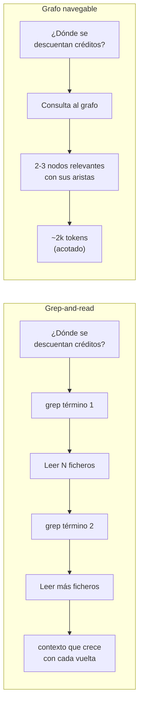

## El problema

Pídele a un agente de código "¿dónde se descuentan los créditos del usuario?" sobre un repo que no conoce y lo verás hacer lo único que sabe hacer: `grep` de un término, abrir los ficheros que salen, `grep` de otro término relacionado, abrir más ficheros, repetir. Cada vuelta cuesta tokens — no porque el modelo razone mal, sino porque **la búsqueda no tiene estructura**. El agente no sabe qué fichero es relevante hasta que lo ha leído entero.

El coste no está en el modelo. Está en cómo busca.

Grepear un repo mediano para una pregunta de una frase puede disparar el contexto a decenas de miles de tokens en lecturas exploratorias antes de llegar a los tres ficheros que de verdad importaban. Ese gasto no aparece en ningún benchmark de "calidad del modelo": aparece en la factura y en la ventana de contexto que ya no tienes disponible para el resto de la tarea.

## Qué vas a aprender

- Por qué un **grafo navegable** (nodos + aristas que el agente recorre paso a paso) sustituye al grep-and-read con menos tokens y más precisión.
- La diferencia entre una arista **EXTRACTED** (está en el código, es un hecho) y una **INFERRED** (la dedujo la herramienta) — y por qué esa distinción es lo que hace el grafo auditable en vez de una caja negra.
- A medir tú mismo el ahorro real de tokens en tu propio repo, en vez de fiarte de la cifra de marketing de nadie.

## Modelo mental



El grafo no reemplaza al modelo leyendo código. Reemplaza la **fase de localizar** qué código leer. Tree-sitter ya hizo el trabajo de parsear el AST una vez, por adelantado, sin gastar ni un token de LLM; el agente solo recorre el resultado.

## Manos a la obra

### 1. Instalar Graphify

Necesitas Python 3.10+ y un gestor de paquetes. En Windows, `uv` se instala con winget:

```bash
winget install astral-sh.uv
```

Con `uv` (o `pipx`) instalado, el paquete de PyPI es `graphifyy` — con doble "y", ojo al escribirlo — pero el comando que queda en el PATH es `graphify`, sin doble y:

```bash
uv tool install graphifyy      # alternativa: pipx install graphifyy
```

> [!warning] El nombre del paquete no es el nombre del comando
> Es fácil equivocarse aquí porque son casi iguales. Instalas `graphifyy` (PyPI), ejecutas `graphify` (CLI). Si el comando no se encuentra tras instalar, es casi seguro que tecleaste `graphifyy` al invocarlo en vez de al instalarlo.

### 2. Registrar el skill con tu asistente

Graphify se expone como un *skill* dentro de tu asistente de código, no como un programa aparte que ejecutas y ya. Primero el registro genérico:

```bash
graphify install
```

Y luego el registro específico del asistente que uses (elige el tuyo):

```bash
graphify claude install
graphify cursor install
graphify codex install
graphify gemini install
graphify copilot install
```

> [!check] Checkpoint
> `graphify install` debería terminar sin error y el comando `/graphify` (con barra) debería aparecer disponible dentro de tu asistente — ese es el skill ya registrado, no un comando de shell.

### 3. Generar el grafo de un repo real

Dentro de tu asistente de código, apúntalo a un repo que conozcas bien (para poder juzgar si el resultado tiene sentido) e invoca el skill:

```bash
/graphify .
```

Por debajo pasan dos fases distintas: tree-sitter extrae el AST de todo el código soportado (36 lenguajes: Python, TS, Go, Rust, Java, C/C++, SQL, Terraform...) **sin llamar a ningún LLM** — es análisis determinista. Después, un pase semántico usa el LLM que tengas configurado para lo que tree-sitter no puede parsear como código: documentación, PDFs, imágenes. Por último, un clustering Leiden agrupa el grafo en comunidades y les pone etiqueta semántica.

> [!check] Checkpoint
> Debería aparecer una carpeta `graphify-out/` con tres ficheros: `graph.html` (el grafo interactivo, ábrelo en el navegador y verás que es clicable y filtrable), `GRAPH_REPORT.md` (conceptos clave y conexiones inesperadas que encontró) y `graph.json` (el grafo completo, reutilizable sin volver a leer el repo).

> [!tip] Ábrelo
> Abre el `graph.html` en el navegador: cada nodo es un símbolo del repo, cada arista una relación. Es clicable, filtrable y buscable — la arquitectura de un vistazo, sin releer un solo fichero.

### 4. Consultar el grafo

Ya no necesitas volver a `/graphify`: el grafo generado se consulta por CLI directamente.

```bash
graphify query "what connects auth to the database?"
graphify path "UserService" "DatabasePool"
graphify explain "RateLimiter"
```

> [!check] Checkpoint
> `graphify query` debería devolver una respuesta concreta —nodos y aristas nombrados— no un resumen genérico. Si la pregunta no tiene sentido para tu repo, cámbiala por algo real de tu dominio: un servicio, una clase, una tabla que sepas que existe.

Así responde de verdad `graphify query` (salida real sobre un proyecto propio en .NET, a la pregunta *"¿qué implementa `ISqlParser` y dónde se usa?"*):

```text
Traversal: BFS depth=2 | Start: ['ISqlParser'] | 14 nodes found

NODE ISqlParser        [src=src/MyApp.Core/Interfaces/ISqlParser.cs loc=L5]
NODE ScriptDomParser   [src=src/MyApp.Infrastructure/Parsing/ScriptDomParser.cs]
NODE TreeSitterParser  [src=src/MyApp.Infrastructure/Parsing/TreeSitterParser.cs]
...
EDGE ISqlParser --implements [EXTRACTED]--> ScriptDomParser
EDGE ISqlParser --implements [EXTRACTED]--> TreeSitterParser
EDGE ISqlParser --method     [EXTRACTED]--> .Parse()
EDGE .Parse()   --references [EXTRACTED context=return_type]--> SqlAstModel
```

*La respuesta cita nodos y aristas concretos —no un resumen— cada una marcada `EXTRACTED`, y por eso sabes de dónde sale cada afirmación sin abrir un solo fichero.*

## 📊 Mídelo tú: grep vs. grafo

Aquí está el experimento que de verdad importa de este lab — y es el que la cifra de marketing (**71,5×**, reportada por usuarios de Graphify, no medida por mí) te invita a no hacer: comprobarlo tú mismo, con tu repo y tu pregunta.

La clave es una comparación **limpia**: **dos agentes con el mismo modelo** y **contexto fresco** cada uno — uno responde solo con grep-and-read, el otro solo con el grafo. Separarlos evita que el segundo se aproveche de lo que ya leyó el primero; así el número que salga es honesto y es tuyo, no el de nadie.

### Cómo lanzar la prueba

Elige una pregunta concreta y verificable sobre tu repo — algo cuya respuesta sepas comprobar ("¿dónde se descuentan los créditos?", "¿qué toca la tabla `Orders`?"). Luego lanza **dos agentes con el mismo modelo**, cada uno en una sesión nueva.

**Agente A — grep-and-read** (sin grafo):

```text
Responde SOLO con grep y lectura de ficheros, sin usar Graphify, a esta pregunta
sobre el repo: "<TU PREGUNTA>". Mientras buscas, lleva la cuenta y repórtame al
final: grep lanzados, ficheros abiertos (y su tamaño) y tokens de contexto totales.
```

**Agente B — grafo** (sesión nueva, mismo modelo):

```text
Responde con `graphify query` a esta pregunta sobre el repo: "<TU PREGUNTA>".
Repórtame los tokens de los nodos y aristas que devuelve el grafo.
```

**Consolida el resultado:** junta las dos salidas en una tabla comparativa y guárdala como un fichero markdown (`comparativa.md`) en la raíz del repo — así queda el número medido, con fecha, para poder volver a él. La tabla, rellena con **tus** números:

| Métrica | Grep-and-read | Grafo (`graphify query`) |
|---|---|---|
| `grep` lanzados | … | 0 |
| Ficheros abiertos | … | 0 (solo nodos citados) |
| Tokens de contexto | … | … |
| **Contexto ahorrado** | — | **… ×** |

> [!example] Resultado real — y por qué hay que medir
> **Este blog (Quartz, 610 nodos), tokenizador real (tiktoken).** El grafo abre **0 ficheros** (responde con `graphify query`); el grep abre los que haga falta. 6 de las 16 preguntas medidas:
>
> | Pregunta | ficheros (grep) | grep tk | grafo tk | ahorro |
> |---|---|---|---|---|
> | GlobalConfiguration | 8 | 8.734 | 1.754 | 5,0× |
> | GraphOptions | 1 | 1.632 | 496 | 3,3× |
> | FullPageLayout | 5 | 4.526 | 1.759 | 2,6× |
> | PageList | 4 | 3.426 | 1.705 | 2,0× |
> | QuartzConfig | 3 | 1.433 | 1.750 | 0,8× |
> | Analytics | 1 | 708 | 991 | 0,7× |
>
> **Sobre las 16: mediana ~2×, rango 0,5–37×, y en 4 el grep salió más barato** (abría pocos ficheros y el `graphify query` tiene un coste base que no es cero, ~500–1.700 tk). El grafo gana cuando el grep tendría que abrir **muchos** ficheros; empata o pierde cuando la respuesta ya estaba en 1-2 pequeños. Moraleja: mide *tu* repo con este lab, no te fíes del titular.

> [!check] Checkpoint
> El agente termina con una cifra propia de ahorro (grep vs. grafo) sobre tu repo. **No es "71,5×"**: es 8×, 40× o lo que te haya salido. Lo que prueba el experimento no es el número, es que **la estructura del dato de búsqueda importa más que el tamaño del modelo** que busca.

**Por qué gana el grafo:** en grep-and-read el agente abre ficheros que no venían al caso solo porque la palabra aparecía de pasada. El grafo no: la arista ya codifica la relación real, y la marca como **EXTRACTED** (está en el código: una llamada, un import, un FK) o **INFERRED** (la dedujo Graphify). Por eso la respuesta del grafo cita sus fuentes y sabes qué fiar y qué verificar — mientras que grep te devuelve coincidencias de texto que hay que leer para descartar.

## 🧮 ¿Cuánto ahorra? Depende — y ese es el punto

No hay un "×" fijo. Ajusté el contexto de **16 preguntas reales** con un tokenizador real (tiktoken): el coste del **grep crece ~lineal con los ficheros** que toca la pregunta; el del **grafo se queda topado** por su presupuesto (`--budget`), da igual lo grande que sea el repo.


*Cada punto, una pregunta. Regresión: `grep ≈ 1.100 · ficheros^0,89` (R²=0,73 — **~lineal**, no una curva mágica); el grafo (teal) se queda plano bajo el budget. Resultado: **mediana ~2×, hasta 37×**, y en **4 de 16 gana el grep**. La cifra por fichero es de este repo — en el tuyo será otra.*

> [!warning] Qué es esto, y qué no
> Esto es una **validación suave**: N=16 preguntas sobre **un solo repo** (este blog). No es un benchmark ni una ley del coste — la regresión ajusta *estos* puntos, no predice el tuyo. Lo único que prueba, y no es poco, es que **el 71,5× del titular no generaliza** a una pregunta cualquiera. Para saber tu número, mídelo: por eso este lab te da el método, no una cifra para citar.

**Un matiz que no se suele decir:** el grafo **vale lo que su extractor**. Tree-sitter lee *sintaxis*, no *semántica*: es preciso y barato para lo estructural —quién implementa, quién llama, qué importa—, pero **no resuelve tipos ni genéricos**, así que el wiring de runtime (un `AddTransient<T>` de inyección de dependencias, la reflection) se le escapa. Un extractor con análisis semántico de verdad —Roslyn en .NET, o el propio compilador del lenguaje— sí lo capturaría; con tree-sitter hay **pérdida de información**. Por eso ahí el grep sigue siendo la red. **Grafo para estructura, grep para lo dinámico.**

(Ojo: Graphify sí añade aristas `INFERRED`, pero son **heurísticas** —adivina relaciones probables—, no la resolución semántica que te daría un compilador.)

> [!info] Próximo avance
> El análisis riguroso queda para la siguiente entrega: **loops reales de agente** (dos agentes con el mismo modelo, uno solo-grep y otro solo-graphify), **precisión por tipo de pregunta**, si el coste es de verdad super-lineal contra la *complejidad* (aquí solo lo medí contra ficheros, y salió ~lineal), y por qué **darle el `graph.json` entero al modelo es la trampa** (cientos de miles de tokens de ruido).

## Prueba tú

Genera el grafo de un repo que no sea tuyo — una dependencia open source que uses a diario y de la que no conozcas las tripas. Pregúntale a `graphify explain` por el componente que más te intriga. Compara lo que responde con lo que tardarías tú en encontrarlo a mano navegando GitHub. ¿Dónde falla el grafo — qué relación importante no capturó tree-sitter porque solo existe en tiempo de ejecución (reflection, inyección de dependencias dinámica, wiring por configuración)?

## Qué te llevas

Graphify materializa una idea sencilla pero potente: no ayudas a un agente dándole *más* datos, le ayudas dándole datos **navegables** — que pueda recorrer por pasos en vez de procesar de golpe.

Graphify extrae con tree-sitter, así que brilla en **código**: cualquiera de los 36 lenguajes soportados, sin coste de LLM en la extracción. Cuando tu dominio **no** es código —datos, catálogos de metadatos, documentación estructurada— tree-sitter no llega, y ahí toca un grafo a medida (un fichero por nodo, navegación por saltos). Yo construí uno así para otro proyecto propio, y el patrón de fondo es el mismo: partición + navegación por pasos gana a "dar el grafo entero" o "dar el repo entero", casi siempre.

**Cuándo usar cada uno:** Graphify cuando el problema es código y quieres algo que se instala en cinco minutos. Un grafo a medida cuando el dominio se sale de "código" o necesitas control fino sobre qué va en cada nodo y cómo se conecta, cosa que una herramienta genérica no te va a dar.

## Reprodúcelo con tu agente

El blog como laboratorio: pégale este bloque a tu agente y que monte el lab contigo.

```text
Vamos a montar el lab de Graphify sobre este repo, paso a paso.
1. Instala graphifyy (uv tool install graphifyy, o pipx) y verifica que el
   comando graphify responde.
2. Registra el skill con el asistente que estoy usando (graphify install + su
   subcomando) y genera el grafo con /graphify . — enséñame graphify-out/:
   abre graph.html y resúmeme GRAPH_REPORT.md.
3. Mídelo: te haré una pregunta concreta y verificable sobre este código.
   Respóndela dos veces con contexto fresco — una solo con grep y lectura de
   ficheros, otra solo con graphify query — y dame una tabla comparativa
   (grep lanzados, ficheros abiertos, tokens de contexto y ahorro real).
   Guárdala como comparativa.md. Quiero el número de MI repo, no el de marketing.
```

Contexto que necesita: acceso a un repo real (el suyo o uno de referencia) para generar el grafo, permiso para instalar `uv`/`graphifyy` si no los tiene, y —para el paso de medir— que tú le confirmes qué pregunta concreta usar, porque tiene que ser algo verificable en tu propio código, no un ejemplo genérico.

En cada checkpoint debe verificar de verdad, no asumir: que `graphify-out/` existe con los tres ficheros, que el skill responde dentro del asistente (`/graphify`), y que `graphify query` de la CLI devuelve nodos y aristas nombrados, no un resumen vago.

## Cuestionario para tu agente

- [ ] ¿Se instaló `graphifyy` (PyPI) y se verificó que el comando `graphify` responde (`graphify --version` o equivalente)?
- [ ] ¿Se registró el skill con el asistente de código en uso (`graphify install` + el subcomando del asistente)?
- [ ] ¿Se generó `graphify-out/` con los tres ficheros (`graph.html`, `GRAPH_REPORT.md`, `graph.json`) sobre un repo real?
- [ ] ¿Se ejecutó al menos una consulta (`graphify query`, `graphify path` o `graphify explain`) y se comprobó que la respuesta cita nodos/aristas concretos del repo, no una respuesta genérica?
- [ ] ¿Se midió el ahorro real de tokens en el repo del usuario (grep-and-read vs. grafo) para la misma pregunta, en vez de asumir la cifra de marketing?
- [ ] ¿Se informó al usuario del resultado final: ruta de `graphify-out/`, asistente registrado y el número de tokens medido en el experimento?

## Comprueba lo aprendido

> [!question]- ¿Por qué tree-sitter no necesita llamar a un LLM para extraer el grafo de código, pero el pase semántico de documentación sí?
> Tree-sitter parsea gramática: produce un AST determinista a partir de la sintaxis del lenguaje (funciones, llamadas, imports), lo mismo que hace un compilador antes de generar código máquina. No hay ambigüedad que resolver, así que no hace falta un modelo. Un PDF o una imagen no tiene gramática formal — entender "de qué habla" este documento y cómo se relaciona con el código requiere interpretación semántica, que es justo lo que aporta un LLM.

> [!question]- ¿Qué diferencia práctica hay entre una arista EXTRACTED y una INFERRED, y por qué te debería importar cuál es cuál?
> EXTRACTED viene directamente del fuente — una llamada de función, un import, una FK — es un hecho verificable con solo mirar el código. INFERRED es una relación que Graphify dedujo sin que estuviera escrita explícitamente (por ejemplo, dos módulos que comparten un tipo de dato sin llamarse entre sí). Te debería importar porque determina cuánto puedes fiarte de la respuesta sin verificar: una cadena de aristas EXTRACTED es tan fiable como el código mismo; una INFERRED es una hipótesis razonable, no un hecho, y merece una comprobación antes de actuar sobre ella.

> [!question]- El lab pide medir tú mismo el ahorro de tokens en vez de citar el "71,5×" de Graphify sin más. ¿Por qué importa esa distinción?
> Porque la cifra de otro repo, con otra pregunta y otro tamaño de codebase, no predice lo que pasará en el tuyo. El ahorro depende de cuánto ruido hay realmente en tu repo respecto a la pregunta que haces — un monolito con nombres pobres se beneficia mucho más del grafo que un repo pequeño y bien organizado donde el grep ya era casi directo. Medir tu propio caso es lo que separa una decisión de arquitectura de repetir un titular.

> [!question]- ¿Por qué el coste del grafo se mantiene ~plano aunque el repo crezca, y el del grep no?
> Porque un `graphify query` está acotado por el presupuesto (`--budget`): devuelve solo el subgrafo relevante, no importa si el repo tiene 127 nodos o 610. El grep, en cambio, lee ficheros enteros, y cuantos más ficheros mencionen el término, más tokens gasta — su coste crece ~lineal con los ficheros que toca la pregunta, mientras el del grafo se queda topado.

> [!question]- ¿Cuándo elegirías construir un grafo a medida en vez de usar Graphify?
> Cuando el dominio no es código fuente que tree-sitter pueda parsear — datos, catálogos de metadatos, documentación estructurada con su propia semántica — o cuando necesitas control fino sobre qué información exacta lleva cada nodo y cómo se calculan sus aristas. Graphify gana en velocidad de puesta en marcha y cobertura de lenguajes; un grafo a medida gana cuando el dominio se sale de "código".

## Referencias

- [Graphify](https://graphify.net/)
- [Repositorio en GitHub](https://github.com/safishamsi/graphify)
