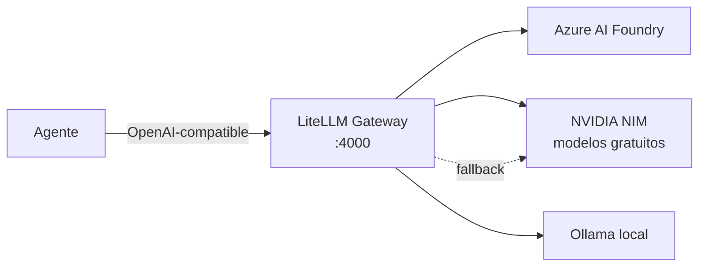

Cuando conectas tu primer agente a un LLM, eliges un proveedor y escribes su SDK directamente en el código. Funciona. Y sin darte cuenta acabas de firmar tres deudas a la vez.

La primera es de **acoplamiento**: el nombre del modelo, el formato de la petición y las claves están cosidos por todo tu código. La segunda es de **disponibilidad**: cuando ese proveedor tiene una caída —y la tendrá— tu agente se para en seco. La tercera es de **coste y control**: no puedes mandar la tarea barata a un modelo gratuito y la crítica a uno de pago sin reescribir la integración.

Y el escenario real es peor que el teórico, porque no eliges *un* proveedor: la empresa tiene **Azure AI Foundry** por contrato, tú tienes los **modelos gratuitos de NVIDIA** (NIM API) para experimentar sin coste, y un **Ollama local** para lo que no puede salir de tu máquina. Tres proveedores, tres dialectos, tres formas de autenticar.

Eso es la **entropía multiproveedor**: cada proveedor que añades mete desorden en el sistema — otro dialecto de API, otro esquema de autenticación, otro catálogo de modelos que evoluciona por su cuenta. Y el desorden crece más rápido que el número de proveedores, porque cada integración nueva interactúa con todas las anteriores. Resolverlo a mano —un `if` por proveedor— no reduce la entropía: la reparte por tu código.

La solución es un patrón de infraestructura clásico: **un gateway**. Una pieza que absorbe el desorden por dentro —habla el dialecto de cada proveedor— y expone orden por fuera: un único contrato OpenAI-compatible. Ese gateway es [LiteLLM](https://docs.litellm.ai/).

---

## 🏗️ La arquitectura: un endpoint, N proveedores

El agente deja de conocer a los proveedores. Solo conoce al gateway. Cambiar de proveedor pasa a ser un cambio de configuración, no de código.



> [!info] Componentes del stack
> - **Cliente:** cualquier agente que hable OpenAI (SDK, Claude Code, Cursor, un `curl`).
> - **Gateway:** LiteLLM Proxy en contenedor (Docker Compose, endpoint `:4000`).
> - **Proveedores:** Azure AI Foundry (contrato empresa), NVIDIA NIM (gratuito, [build.nvidia.com](https://build.nvidia.com)), Ollama (local, privacidad).

La estrategia de routing sale sola de las restricciones: **NVIDIA para experimentar** (gratis), **Azure para producción** (contrato y compliance), **Ollama para lo sensible** (no sale de casa). El fallback conecta los tres: si Azure no responde, la petición cae a NVIDIA.

## ⚙️ Los tres ficheros

Todo el laboratorio son tres ficheros en un directorio vacío: `docker-compose.yml` (la infraestructura), `config.yaml` (el conocimiento de proveedores) y `.env` (las claves, que nunca tocan los otros dos).

### 1. `docker-compose.yml`

```yaml
services:
  litellm:
    image: ghcr.io/berriai/litellm:main-stable
    container_name: litellm_gateway
    ports:
      - "4000:4000"
    volumes:
      - ./config.yaml:/app/config.yaml:ro
    command: ["--config", "/app/config.yaml", "--port", "4000"]
    env_file:
      - .env
    restart: unless-stopped
    extra_hosts:
      - "host.docker.internal:host-gateway"   # para alcanzar Ollama en el host
```

### 2. `config.yaml` — donde la entropía se ordena

Cada entrada mapea un **nombre lógico** (el que usará el agente) a un **modelo real** de un proveedor concreto:

```yaml
model_list:
  # ── Azure AI Foundry: el contrato de empresa ─────────────────
  - model_name: produccion
    litellm_params:
      model: azure/gpt-4o                    # nombre del *deployment* en Foundry
      api_base: os.environ/AZURE_API_BASE    # https://<recurso>.openai.azure.com
      api_key: os.environ/AZURE_API_KEY
      api_version: "2024-10-21"

  # ── NVIDIA NIM: modelos gratuitos para experimentar ──────────
  - model_name: experimentos
    litellm_params:
      model: nvidia_nim/meta/llama-3.3-70b-instruct
      api_key: os.environ/NVIDIA_NIM_API_KEY # gratis en build.nvidia.com

  # ── Ollama: 100% local, para datos que no salen de casa ──────
  - model_name: local
    litellm_params:
      model: ollama/llama3
      api_base: http://host.docker.internal:11434

# El corazón del patrón: si producción falla, cae a los gratuitos,
# y si tampoco, al modelo local.
litellm_settings:
  fallbacks:
    - produccion: ["experimentos", "local"]

general_settings:
  master_key: sk-lab-1234                    # clave que usarán los clientes
```

Fíjate en lo que acabas de comprar: el agente pedirá `produccion` sin saber que es Azure, y si Azure no responde, LiteLLM redirige la misma petición al modelo gratuito de NVIDIA y, en última instancia, al local. **El fallback es la entropía multiproveedor resuelta en tres líneas.**

### 3. `.env` — las claves, fuera de la configuración

```bash
AZURE_API_BASE=https://mi-recurso.openai.azure.com
AZURE_API_KEY=...
NVIDIA_NIM_API_KEY=nvapi-...
```

> [!note] Nombres de modelo
> `gpt-4o` es el nombre de **tu deployment** en Azure AI Foundry (puede llamarse como quieras al desplegarlo); `meta/llama-3.3-70b-instruct` es un modelo del catálogo gratuito de NVIDIA. Ambos catálogos evolucionan: ajusta cada `model:` al vigente. Para modelos de Foundry que no son de OpenAI (DeepSeek, Phi, Mistral serverless) el prefijo en LiteLLM es `azure_ai/` en lugar de `azure/`.

## 🚀 Arrancar y verificar

```bash
docker compose up -d
```

Comprueba que el gateway está vivo (sin clave):

```bash
curl -s http://localhost:4000/health/liveliness
# "I'm alive!"
```

Y una petición real, ya en formato OpenAI, contra el nombre lógico:

```bash
curl -s http://localhost:4000/v1/chat/completions \
  -H "Authorization: Bearer sk-lab-1234" \
  -H "Content-Type: application/json" \
  -d '{
    "model": "experimentos",
    "messages": [{"role": "user", "content": "Resume el patrón gateway en una frase."}]
  }'
```

## 🔌 Conectar tu agente al gateway

Aquí está el pago del patrón. El agente **no cambia**: solo lo apuntas al gateway. Como LiteLLM habla OpenAI, cualquier cliente OpenAI sirve con dos variables de entorno:

```bash
export OPENAI_API_BASE="http://localhost:4000/v1"
export OPENAI_API_KEY="sk-lab-1234"
```

```python
from openai import OpenAI

# El agente cree que habla con OpenAI. Habla con tu gateway.
client = OpenAI()  # lee OPENAI_API_BASE y OPENAI_API_KEY del entorno

resp = client.chat.completions.create(
    model="experimentos",         # nombre lógico, no proveedor
    messages=[{"role": "user", "content": "Dame un plan en 3 pasos."}],
)
print(resp.choices[0].message.content)
```

Para saltar de NVIDIA a Azure no tocas ni una línea de Python: cambias `model="experimentos"` por `model="produccion"`, o dejas que el `fallback` decida cuando el primario caiga. El agente ha quedado **desacoplado del proveedor**, que era todo el objetivo.

> [!tip] Agentes que hablan Anthropic (Claude Code, etc.)
> LiteLLM también expone un endpoint compatible con la API de Anthropic. Puedes apuntar herramientas que usan `ANTHROPIC_BASE_URL` al gateway y enrutar por debajo hacia cualquiera de los tres proveedores.

---

## Notas para agentes

> [!info] Si reproduces este lab con tu agente
> Los pasos ya están en el post; los bloques de código de *"Los tres ficheros"* son la fuente canónica. Estas notas son lo que la narrativa no dice:

- **Antes de empezar:** verifica que `docker compose version` responde y pregunta al usuario qué proveedores tiene (Azure, NVIDIA NIM, Ollama) y dónde quiere el directorio de trabajo.
- **Adapta la config:** elimina de `model_list` los proveedores que el usuario no tenga y ajusta los `fallbacks` a los que queden. Genera un `master_key` aleatorio en lugar de `sk-lab-1234`.
- **Claves:** pídeselas al usuario y ponlas solo en `.env`. Nunca las inventes ni las escribas en `config.yaml`.
- **Hecho significa verificado:** no des el lab por completado hasta que `/health/liveliness` responda y una petición a `/v1/chat/completions` devuelva contenido. Termina informando del endpoint, el `master_key` y los nombres lógicos disponibles.
- **Si algo falla:** `docker compose logs litellm`. Lo típico: 401 del proveedor (clave), deployment de Azure que no coincide, Ollama inaccesible desde el contenedor (`extra_hosts`).

## Aplícalo

Copia esto a tu agente (si no tiene acceso web, pégale el post completo en su lugar):

```text
Lee https://blog.rcmon.dev/02-Laboratorios/litellm-multiproveedor y móntame
el gateway LiteLLM del lab. Sigue las "Notas para agentes" del final:
pregúntame qué proveedores tengo y dónde quiero el directorio de trabajo,
pídeme las claves (van solo en .env) y no lo des por hecho hasta verificar
/health/liveliness y una petición de chat real.
```

---

## ✅ Resultado

Con un gateway y tres ficheros:

- **Un contrato, N proveedores.** El agente habla un solo dialecto.
- **Fallback automático.** Una caída de Azure deja de ser una caída de tu agente.
- **Routing por coste y privacidad.** Experimentos → NVIDIA gratis; producción → Azure; datos sensibles → Ollama local. Decidido por configuración.
- **Claves centralizadas.** Rotación y auditoría en un punto (`.env`), no repartidas por el código.

La entropía multiproveedor no se resuelve eligiendo bien el proveedor. Se resuelve **dejando de elegir en el código** y concentrando el desorden en una capa que puedes cambiar sin desplegar.

## 📎 Referencias

- [Documentación de LiteLLM](https://docs.litellm.ai/)
- [LiteLLM Proxy — configuración](https://docs.litellm.ai/docs/proxy/configs)
- [Azure AI Foundry en LiteLLM](https://docs.litellm.ai/docs/providers/azure_ai)
- [NVIDIA NIM en LiteLLM](https://docs.litellm.ai/docs/providers/nvidia_nim) · [Catálogo gratuito](https://build.nvidia.com)
- [Lab: Ollama + Docker en local](https://blog.rcmon.dev/02-Laboratorios/ollama-docker-local) — el modelo `local` de este `config.yaml`.
