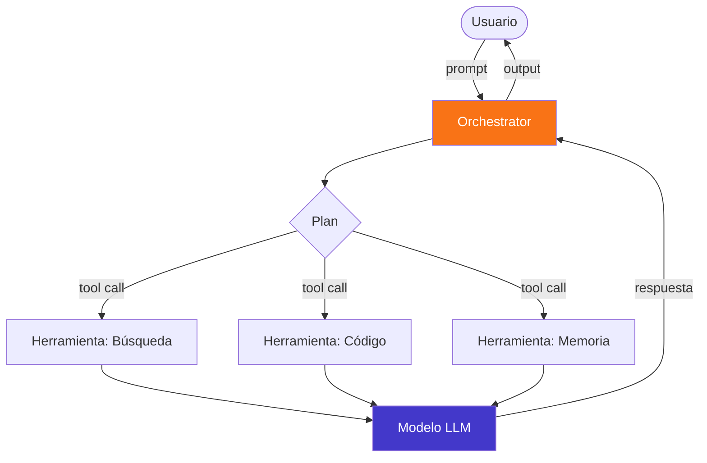
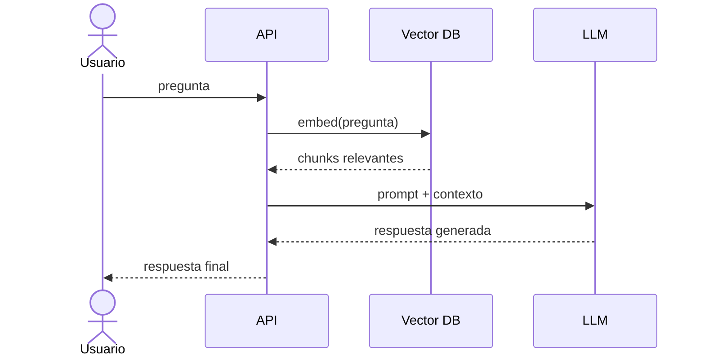
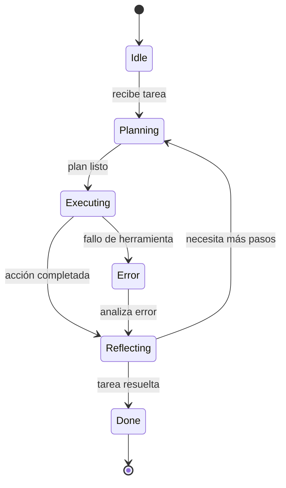
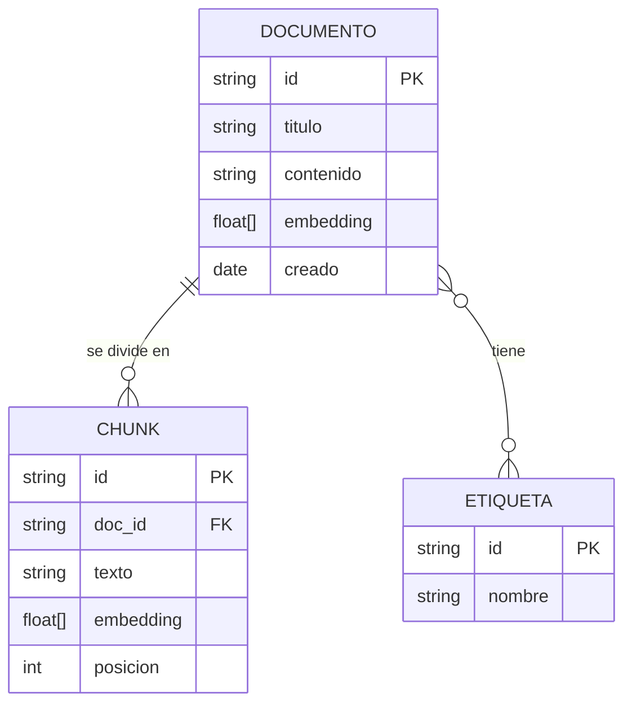
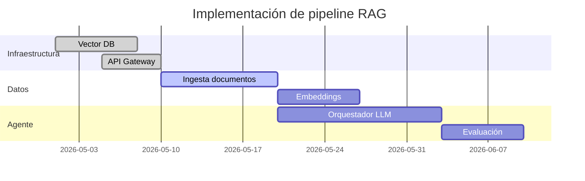
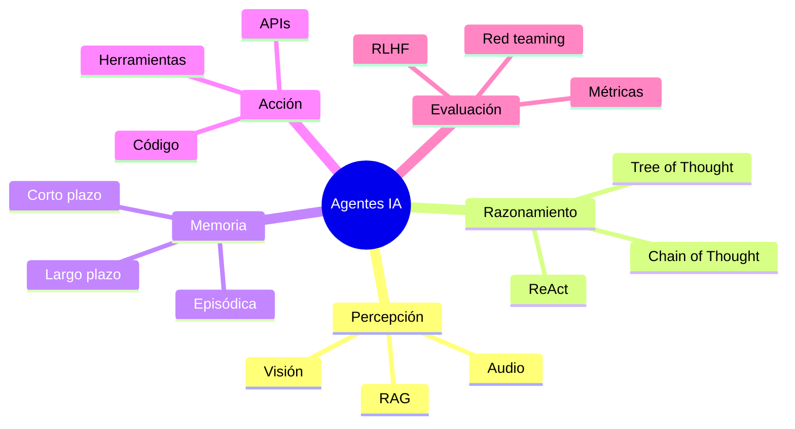

Comprobación de los tipos de diagrama Mermaid disponibles en Quartz.

---

## Flowchart — Arquitectura de agente IA

---

## Sequence — Flujo RAG

---

## Architecture — Capas de sistema IA

---

## State — Ciclo de vida de un agente

---

## ERD — Modelo de datos de Knowledge Base

---

## Gantt — Roadmap de implementación

---

## Mindmap — Ecosistema de Agentes IA

