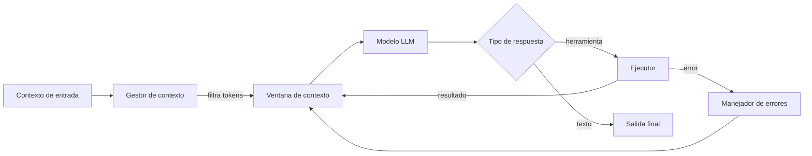
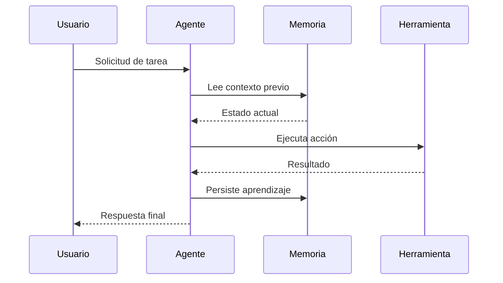
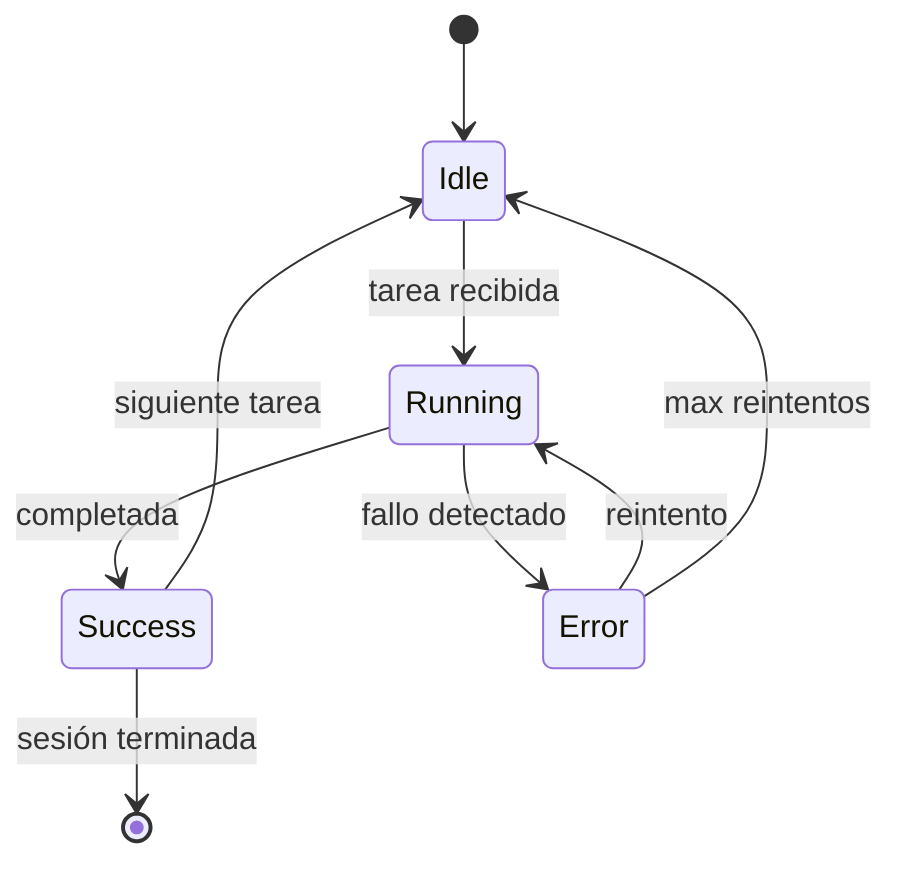

Página de referencia interna. Todos los componentes visuales del blog en un solo lugar para validar coherencia antes de publicar nuevas secciones.

---

## 1. Encabezados

# H1 — Título de página principal

## H2 — Sección de nivel 2

### H3 — Subsección

#### H4 — Sub-subsección

##### H5 — Nivel 5 (uppercase, gris)

###### H6 — Nivel 6 (uppercase, gris claro)

---

## 2. Cuerpo de texto — prosa

Párrafo estándar de lectura técnica. **Negrita para énfasis fuerte**, _cursiva para términos o matices_. ~~Tachado para contenido obsoleto~~. ==Resaltado de texto== con la sintaxis de Obsidian.

Un segundo párrafo para verificar el espaciado entre bloques. El `line-height: 1.85` y `letter-spacing: 0.01em` están calibrados para sesiones de lectura de 20+ minutos.

<small>Texto pequeño — útil para disclaimers o notas al margen.</small>

Texto con <sup>superíndice</sup> y <sub>subíndice</sub>. Abreviatura: <abbr title="Arquitectura de Microservicios">AM</abbr>.

**Negrita dentro de párrafo** — `p > strong` usa `var(--dark)` para dar contraste extra sobre el gris del cuerpo.

---

## 3. Links

- [Link interno — inicio](../index.md)
- [Link interno — artículo](../04%20Arquitectura%20IA/harness-engineering-agentes-ia.md)
- [Link externo — blog](https://blog.rcmon.dev)
- Tag como link: #arquitectura #ia

Texto con [link inline](../index.md) en la prosa. Hover cambia de `--secondary` (teal-700) a `--tertiary` (cyan-600).

---

## 4. Listas

### Lista sin orden

- Primer elemento
- Segundo — con **negrita** interna
- Tercero con `código inline`

### Anidada

- Nivel 1
  - Nivel 2
    - Nivel 3
  - Nivel 2 de nuevo
- Nivel 1 de nuevo

### Numerada

1. Define el perímetro de acción del agente
2. Construye el bucle de ejecución mínimo
3. Añade memoria persistente desde el día 1
4. Instrumenta antes de optimizar

### Numerada anidada

1. Fase de diseño
   1. Análisis de requisitos
   2. Diseño de interfaces
2. Fase de implementación
   1. Setup del entorno
   2. Desarrollo iterativo

### Tareas

- [x] Tokens CSS (`--rcm-*`) — completado
- [x] Paleta Stone × Teal — completado
- [x] Mermaid en paleta — completado
- [ ] Graph view en producción — pendiente
- [ ] Accesibilidad WCAG AA — pendiente

### Definiciones

<dl>
  <dt><strong>Harness</strong></dt>
  <dd>Infraestructura de control que rodea a un LLM. No es el modelo, es el sistema.</dd>
  <dt><strong>AGENTS.md</strong></dt>
  <dd>Constitución del agente. Define restricciones, herramientas y contexto de proyecto.</dd>
  <dt><strong>Efecto ratchet</strong></dt>
  <dd>Mecanismo por el que el sistema mejora sesión a sesión sin poder retroceder.</dd>
</dl>

---

## 5. Código

### Inline

El comando `git commit --amend` reescribe el último commit. La variable `$HOME` apunta al directorio del usuario. El tipo `Promise<Agent>` devuelve el inicializador del harness.

### Atajos de teclado

Guarda con <kbd>Ctrl</kbd> + <kbd>S</kbd>. Paleta: <kbd>Ctrl</kbd> + <kbd>Shift</kbd> + <kbd>P</kbd>. En Mac: <kbd>⌘</kbd> + <kbd>K</kbd>. Cancela: <kbd>Esc</kbd>.

### TypeScript

```typescript
interface HarnessConfig {
  model: string
  maxTokens: number
  tools: ToolDefinition[]
  memoryPath: string
}

async function initHarness(config: HarnessConfig): Promise<Agent> {
  const memory = await loadMemory(config.memoryPath)
  return new Agent({
    ...config,
    systemPrompt: buildSystemPrompt(memory),
  })
}
```

### Python

```python
from anthropic import Anthropic

client = Anthropic()

def run_agent(task: str, memory: dict) -> str:
    response = client.messages.create(
        model="claude-sonnet-4-6",
        max_tokens=4096,
        system=build_system_prompt(memory),
        messages=[{"role": "user", "content": task}]
    )
    return response.content[0].text
```

### Bash

```bash
# Build y servidor local
node ./quartz/bootstrap-cli.mjs build --serve
```

### YAML

```yaml
name: Deploy to GitHub Pages
on:
  push:
    branches: [v4]
jobs:
  build:
    runs-on: ubuntu-latest
    steps:
      - uses: actions/checkout@v4
      - run: npx quartz build
```

### SCSS

```scss
:root {
  --rcm-teal-strong: #0d9488;
  --rcm-teal:        #0f766e;
  --rcm-cyan:        #0891b2;
  --rcm-teal-pale:   rgba(15, 118, 110, 0.07);
}
```

---

## 6. Diagramas Mermaid

### Flowchart



### Sequence Diagram



### State Diagram



---

## 7. Tablas

### Comparativa de modelos

| Modelo | Contexto | Velocidad | Coste | Uso recomendado |
|--------|----------|-----------|-------|-----------------|
| Claude Opus 4.7 | 200k | Media | $$$ | Razonamiento complejo |
| Claude Sonnet 4.6 | 200k | Alta | $$ | Producción, agentes |
| Claude Haiku 4.5 | 200k | Muy alta | $ | Clasificación rápida |
| GPT-4o | 128k | Alta | $$ | Multimodal, OpenAI |
| Gemini 2.0 Flash | 1M | Muy alta | $ | Contexto largo |

### Con alineación de columnas

| Componente | Estado | Prioridad | Notas |
|:-----------|:------:|----------:|-------|
| Tokens CSS | ✅ Done | Alta | `_rcm-brand.scss` |
| Tipografía | ✅ Done | Alta | Bricolage + DM Sans |
| Mermaid | ✅ Done | Media | Transparente, borde teal |
| Tablas | ✅ Done | Media | Hover teal, th con acento |
| Formularios | ✅ Done | Baja | CSS scoped a artículos |

---

## 8. Blockquotes

> La efectividad de un agente IA no depende del modelo, sino del harness que lo rodea.

> **Cita atribuida:** El arquitecto no diseña el modelo. Diseña el entorno en el que el modelo opera.

---

## 9. Callouts

> [!NOTE] Nota técnica
> Callout `NOTE` — fondo azul sutil.

> [!TIP] Consejo práctico
> Callout `TIP` — fondo verde.

> [!WARNING] Advertencia
> Callout `WARNING` — fondo ámbar.

> [!IMPORTANT] Crítico
> Callout `IMPORTANT` — rojo, acción requerida.

> [!INFO] Información
> Callout `INFO` — azul claro.

> [!EXAMPLE] Ejemplo
> Callout `EXAMPLE` — fondo neutro.

> [!QUESTION] Pregunta abierta
> Callout `QUESTION` — decisión pendiente.

> [!BUG] Bug conocido
> Callout `BUG` — issue documentado.

> [!SUCCESS] Confirmado
> Callout `SUCCESS` — validación exitosa.

---

## 10. Separadores

Separador estándar `---`:

---

Divisor de marca `.rcm-divider`:

<hr class="rcm-divider">

---

## 11. Imágenes y media

Imagen con caption (SVG inline — sin dependencias externas):

%22%20stroke-width%3D%221%22%2F%3E%3Crect%20x%3D%22310%22%20y%3D%2280%22%20width%3D%22180%22%20height%3D%2280%22%20rx%3D%228%22%20fill%3D%22rgba(255,255,255,0.15)%22%2F%3E%3Crect%20x%3D%22310%22%20y%3D%22200%22%20width%3D%22180%22%20height%3D%2280%22%20rx%3D%228%22%20fill%3D%22rgba(255,255,255,0.10)%22%2F%3E%3Crect%20x%3D%22570%22%20y%3D%22130%22%20width%3D%22180%22%20height%3D%2280%22%20rx%3D%228%22%20fill%3D%22rgba(255,255,255,0.12)%22%2F%3E%3Cline%20x1%3D%22230%22%20y1%3D%22160%22%20x2%3D%22310%22%20y2%3D%22120%22%20stroke%3D%22rgba(255,255,255,0.5)%22%20stroke-width%3D%221.5%22%2F%3E%3Cline%20x1%3D%22230%22%20y1%3D%22200%22%20x2%3D%22310%22%20y2%3D%22240%22%20stroke%3D%22rgba(255,255,255,0.5)%22%20stroke-width%3D%221.5%22%2F%3E%3Cline%20x1%3D%22490%22%20y1%3D%22120%22%20x2%3D%22570%22%20y2%3D%22160%22%20stroke%3D%22rgba(255,255,255,0.5)%22%20stroke-width%3D%221.5%22%2F%3E%3Cline%20x1%3D%22490%22%20y1%3D%22240%22%20x2%3D%22570%22%20y2%3D%22180%22%20stroke%3D%22rgba(255,255,255,0.5)%22%20stroke-width%3D%221.5%22%2F%3E%3Ctext%20x%3D%22130%22%20y%3D%22165%22%20text-anchor%3D%22middle%22%20font-family%3D%22sans-serif%22%20font-size%3D%2213%22%20fill%3D%22rgba(255,255,255,0.7)%22%3EContexto%3C%2Ftext%3E%3Ctext%20x%3D%22400%22%20y%3D%22125%22%20text-anchor%3D%22middle%22%20font-family%3D%22sans-serif%22%20font-size%3D%2213%22%20fill%3D%22white%22%3EModelo%3C%2Ftext%3E%3Ctext%20x%3D%22400%22%20y%3D%22245%22%20text-anchor%3D%22middle%22%20font-family%3D%22sans-serif%22%20font-size%3D%2213%22%20fill%3D%22rgba(255,255,255,0.8)%22%3EMemoria%3C%2Ftext%3E%3Ctext%20x%3D%22660%22%20y%3D%22175%22%20text-anchor%3D%22middle%22%20font-family%3D%22sans-serif%22%20font-size%3D%2213%22%20fill%3D%22rgba(255,255,255,0.8)%22%3ESalida%3C%2Ftext%3E%3C%2Fsvg%3E)

_Caption: descripción de la imagen. El `em` inmediatamente después de un `img` se convierte en caption por CSS._

Imagen pequeña:

%22%2F%3E%3Crect%20x%3D%2228%22%20y%3D%2272%22%20width%3D%2264%22%20height%3D%228%22%20rx%3D%224%22%20fill%3D%22rgba(255,255,255,0.5)%22%2F%3E%3Crect%20x%3D%2236%22%20y%3D%2286%22%20width%3D%2248%22%20height%3D%226%22%20rx%3D%223%22%20fill%3D%22rgba(255,255,255,0.3)%22%2F%3E%3C%2Fsvg%3E)

---

## 12. HTML nativo — elementos semánticos

### Details / Summary

<details>
<summary><strong>Expandir — detalles de implementación</strong></summary>

Contenido oculto por defecto. Útil para notas técnicas secundarias o información que no todos los lectores necesitan ver.

```bash
echo "hola desde el acordeón"
```

</details>

<details>
<summary>Segunda sección colapsable</summary>

Otro bloque colapsable. Los `details/summary` tienen el triángulo teal animado con la paleta del brand.

</details>

### Formularios

<div style="max-width:480px">
<form style="display:flex; flex-direction:column; gap:0.8rem;">
  <div>
    <label for="ds-name">Nombre</label>
    <input type="text" id="ds-name" placeholder="Ramón Campos">
  </div>
  <div>
    <label for="ds-email">Email</label>
    <input type="email" id="ds-email" placeholder="r@rcmon.dev">
  </div>
  <div>
    <label for="ds-topic">Tema</label>
    <select id="ds-topic">
      <option>Arquitectura de sistemas</option>
      <option>DevOps y plataformas</option>
      <option>Agentes IA</option>
      <option>Otro</option>
    </select>
  </div>
  <div>
    <label for="ds-message">Mensaje</label>
    <textarea id="ds-message" rows="4" placeholder="Tu mensaje..."></textarea>
  </div>
  <div style="display:flex; gap:0.5rem; align-items:center;">
    <input type="checkbox" id="ds-agree">
    <label for="ds-agree" style="margin:0; font-size:0.85rem;">Acepto que esto es una prueba de diseño</label>
  </div>
  <div>
    <button type="button">Enviar</button>
  </div>
</form>
</div>

---

## 13. Matemáticas — KaTeX

Fórmula inline: la entropía de Shannon es $H = -\sum_{i} p_i \log_2 p_i$.

Fórmula en bloque:

$$
\text{Atención}(Q, K, V) = \text{softmax}\!\left(\frac{QK^T}{\sqrt{d_k}}\right) V
$$

$$
f(x) = \frac{1}{\sigma\sqrt{2\pi}} e^{-\frac{1}{2}\left(\frac{x-\mu}{\sigma}\right)^2}
$$

---

## 14. Utilidades de marca — React-compatible

Estas clases vienen de `_rcm-brand.scss` y son portables a React/Next.js/Vite.

### rcm-card

<div class="rcm-card">

**rcm-card** — bloque destacado. Fondo sutilmente teal, borde y sombra del sistema de tokens.

```tsx
<div className="rcm-card">Contenido destacado</div>
```

</div>

### rcm-chip

Chips inline: <span class="rcm-chip">arquitectura</span> <span class="rcm-chip">harness</span> <span class="rcm-chip">agentes-ia</span> <span class="rcm-chip">devops</span> <span class="rcm-chip">stone×teal</span>

### rcm-prose

<div class="rcm-prose">

Este párrafo está dentro de `.rcm-prose`. Limita el ancho a `72ch` con `line-height: 1.72`. Útil en React para contenedores fuera de `article` que necesitan confort de lectura.

</div>

---

## 15. Tipografía inline avanzada

### mark — resaltado semántico

El modelo no es el problema. <mark>El harness es lo que marca la diferencia</mark> entre un prototipo y un sistema en producción. Múltiples resaltados: <mark>contexto</mark>, <mark>memoria persistente</mark> y <mark>herramientas</mark> son los tres pilares.

### del / ins — control de cambios

El agente <del>no necesita instrucciones detalladas</del> <ins>mejora notablemente con contexto estructurado</ins> cuando el harness está bien diseñado.

Versión anterior: <del>usar el modelo más grande para todo</del>  
Versión actual: <ins>elegir el modelo según tarea y coste</ins>

### abbr — abreviaturas

<abbr title="Large Language Model">LLM</abbr>, <abbr title="Retrieval-Augmented Generation">RAG</abbr>, <abbr title="Model Context Protocol">MCP</abbr>, <abbr title="Continuous Integration / Continuous Deployment">CI/CD</abbr>.

Hover sobre cualquiera para ver la definición completa.

### cite — referencias de obras

Según <cite>The Art of Doing Science and Engineering</cite> de Richard Hamming: "Los problemas más importantes son los que nadie más está intentando resolver".

### sup / sub — índices matemáticos y tipográficos

Física: E = mc<sup>2</sup>. Química: H<sub>2</sub>O. Nota al pie<sup><a href="#fn-1">[1]</a></sup>.

---

## 16. Imágenes con figcaption

HTML `<figure>` con `<figcaption>` real — diferente del `_italic_` que Quartz genera como párrafo em:

<figure>

<figcaption>Fig. 1 — Arquitectura de un sistema agéntico. El harness envuelve al modelo; la memoria es ortogonal a ambos.</figcaption>
</figure>

---

## 17. Notas al pie

Texto con referencia numérica al pie de página<sup id="fnref-1"><a href="#fn-1">[1]</a></sup> y otra de arquitectura<sup id="fnref-2"><a href="#fn-2">[2]</a></sup>.

<div class="footnotes">
<ol>
<li id="fn-1">Claude Sonnet 4.6 en producción como agente autónomo — <code>claude-sonnet-4-6</code>. <a href="#fnref-1">↩</a></li>
<li id="fn-2">Arquitectura event-driven con Kafka para el harness de mensajería asíncrona. <a href="#fnref-2">↩</a></li>
</ol>
</div>

---

## 18. Nuevas features automáticas

Estas tres features se activan solas — sin clases ni markup adicional.

### Barra de progreso lateral

Una línea teal de **2px** crece en el **borde izquierdo** del viewport mientras lees. Se llena de arriba a abajo usando CSS `scroll-driven animations` — sin JavaScript. Solo Chrome 115+ / Safari 18+; el resto no ve nada.

### Marca de fin de artículo

El símbolo **◈** aparece centrado al final de cualquier artículo (excepto el index). Es un pseudo-elemento CSS — no hay que añadir nada en el markdown. Desplázate hasta el final de esta página para verlo.

### TOC — indicador activo

La barra vertical teal de 2px en el TOC crece en el link del heading visible en viewport. Quartz asigna `.in-view` al link activo; el CSS lo convierte en feedback visual. Funciona en el sidebar derecho cuando el artículo tiene suficientes headings.

---

## 19. Selección de texto

Selecciona este párrafo para ver el color de selección. En **light mode** debe ser verde teal translúcido. En **dark mode** teal más saturado. En ningún caso el verde neón por defecto de Quartz.

---

## Notas — portabilidad React

```tsx
// layout.tsx o _app.tsx
import '../styles/_rcm-brand.scss'

// Tokens en componentes
const style = {
  color: 'var(--rcm-teal)',
  borderRadius: 'var(--rcm-radius-md)',
  boxShadow: 'var(--rcm-shadow-sm)',
}
```

Dark mode cubierto para: `[saved-theme="dark"]` (Quartz), `[data-theme="dark"]` (next-themes / shadcn), `.dark` (Tailwind class strategy).
