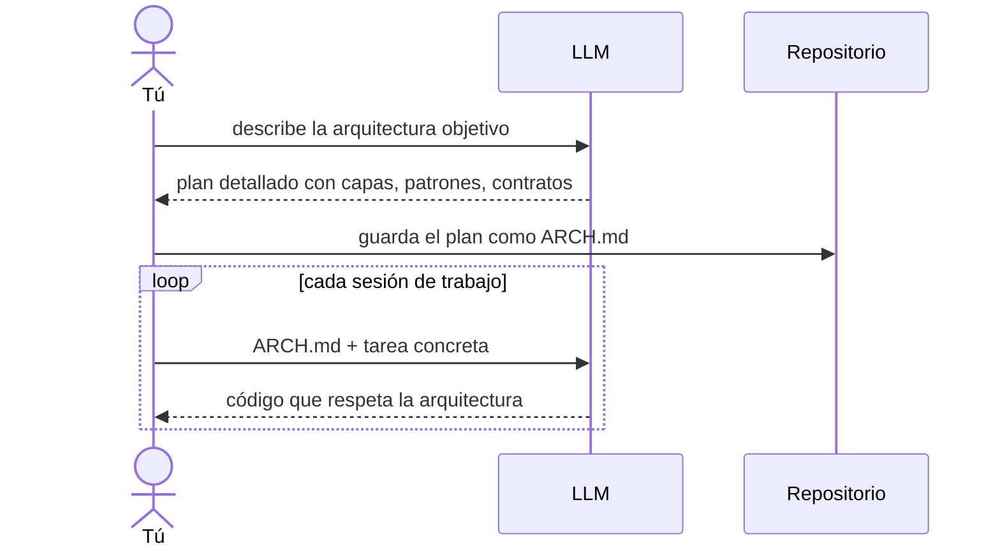

Hay algo que nadie te dice cuando empiezas a integrar LLMs en un proyecto de software real: el modelo no recuerda nada.

Cada sesión empieza de cero. Sin memoria del diseño que tomaste la semana pasada, sin contexto de por qué ese módulo está donde está, sin entender qué compromisos arquitectónicos hay en el sistema. Si no le das esa información explícitamente, generará código que funciona en aislamiento pero no encaja con el resto.

Este es el problema que Fowler documenta con claridad: **la coherencia entre sesiones es un problema de arquitectura, no de prompts**.

## La solución es simple, pero requiere disciplina

El patrón es el siguiente: antes de generar código, generas el plan arquitectónico. Luego ese plan se convierte en el contexto que inyectas al inicio de cada sesión posterior.

La arquitectura deja de ser un documento que lees tú y pasa a ser el **contrato operativo que el agente necesita para funcionar de forma coherente**.

## Lo que esto cambia

Antes, documentar decisiones de arquitectura era una buena práctica. Ahora es una necesidad operativa si trabajas con agentes.

Sin `ARCH.md`, cada sesión del agente produce código que refleja sus propias asunciones sobre cómo debe estar organizado el sistema. Con el tiempo, el proyecto se fragmenta en estilos distintos generados en momentos distintos.

Con `ARCH.md`, el agente opera dentro de los límites que tú has definido. Tú sigues siendo el arquitecto. El agente es el ejecutor.

---

La arquitectura siempre fue una forma de comunicación. Lo que ha cambiado es que ahora también tienes que comunicarte con máquinas.

---

> Basado en la investigación de Xu Hao y Martin Fowler: *"ChatGPT-Driven Development"* (martinfowler.com, 2023).
