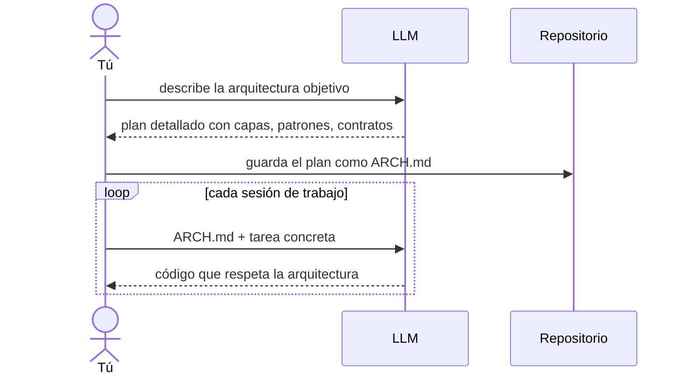

Llevaba tres semanas trabajando en un proyecto con un agente IA. Todo funcionaba. El código que generaba era correcto, las decisiones técnicas eran razonables. Me sentía productivo.

Entonces volví después de un fin de semana.

El agente empezó a sugerir cambios que contradecían decisiones que habíamos tomado días antes. La carpeta `domain/` que habíamos mantenido limpia empezó a llenarse de lógica de infraestructura. Los contratos entre capas que yo había definido dejaron de respetarse.

No había cambiado el modelo. No había cambiado el proyecto. Había cambiado la sesión.

---

Ahí entendí algo que nadie te explica antes de que lo vivas: el modelo no tiene memoria entre sesiones.

Cada vez que lo abres, empieza de cero. Sin contexto del diseño que tomaste la semana pasada. Sin entender por qué ese módulo está donde está. Sin saber qué compromisos arquitectónicos existen en el sistema.

Si no le das esa información explícitamente, genera código que funciona en aislamiento y rompe la coherencia del resto.

---

## Lo que tuve que cambiar

La solución no fue difícil de entender. Fue difícil de aceptar.

Tenía que documentar las decisiones arquitectónicas. No para una auditoría. No para un nuevo empleado hipotético. Para la herramienta con la que trabajo hoy.

El patrón es simple:

Antes de cada sesión, inyecto el `ARCH.md`. El agente opera dentro de los límites que yo he definido. Yo sigo siendo el arquitecto. El agente es el ejecutor.

Sin ese documento, cada sesión produce código que refleja las asunciones propias del modelo sobre cómo debe organizarse un sistema. Con el tiempo, el proyecto se fragmenta — distintos estilos, distintas decisiones, sin memoria de las anteriores.

---

## La arquitectura siempre fue comunicación

Durante años, documentar la arquitectura era una buena práctica. Una de esas cosas que todos decían que había que hacer y pocos hacían.

Ahora es una necesidad operativa.

La arquitectura deja de ser el documento que lees tú y pasa a ser el contrato que el agente necesita para trabajar contigo. No es un cambio menor. Es un cambio de para quién escribes.

Siempre fue una forma de comunicación entre personas. Lo que ha cambiado es que ahora también tienes que comunicarte con máquinas.

Y las máquinas solo leen lo que tienes escrito.

---

> Relacionado: [[04 Arquitectura IA/documento-arquitectura-base|ARCH.md: el documento que le da memoria a tu agente]] · [[04 Arquitectura IA/context-engineering|Context Engineering]]
