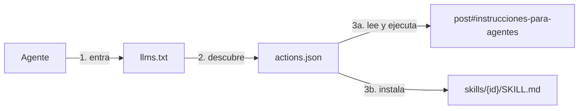

Un blog técnico clásico tiene un único modo de uso: alguien lo lee, entiende (o no), y luego traduce a mano lo leído a comandos en su terminal. La documentación y la ejecución viven en mundos separados, y el puente entre ambos eres tú, copiando bloques de código y esperando que nada haya cambiado desde que se publicó.

Ese modelo se ha quedado corto. Hoy el lector de un post técnico ya no es solo una persona: es una persona **acompañada de un agente**. Y si el agente puede leer la documentación, la pregunta obvia es: ¿por qué debería quedarse en leerla?

Este post documenta la decisión de arquitectura que responde a esa pregunta. Es, en la práctica, el ADR de este blog.

---

## 🎯 La decisión

> [!important] Decisión
> Este blog no es solo una colección de artículos y laboratorios para humanos. Es **documentación as code**: una fuente que cualquier agente puede adjuntar a su contexto, consultar de forma estructurada y —cuando el post lo declara— **ejecutar**. Todo lo que se investiga y documenta aquí debe poder aplicarse, no solo entenderse.

Eso convierte al blog en tres cosas a la vez:

1. **Un blog**, para humanos: artículos, laboratorios, decisiones razonadas.
2. **Una fuente estructurada**, para modelos: `llms.txt` como punto de entrada y `contentIndex.json` como grafo completo del contenido.
3. **Una herramienta**, para agentes: una capa ejecutable donde ciertos posts declaran instrucciones canónicas que un agente puede seguir en la máquina del usuario.

Las dos primeras ya son práctica emergente ([llms.txt](https://llmstxt.org/) se está adoptando como convención). La tercera es la apuesta de este blog.

## 🏗️ La capa ejecutable: cómo funciona

Un post entra en la capa ejecutable declarando un bloque `action:` en su frontmatter — su presencia es el opt-in, y su contenido es lo mínimo que no se puede inferir del texto:

```yaml
action:
  id: setup-litellm-proxy            # identificador estable (URLs, instalación)
  kind: runbook                      # runbook: se ejecuta una vez | skill: práctica reutilizable
  when_to_use: "El usuario quiere un único endpoint OpenAI-compatible con fallback entre proveedores."
```

Nada de booleanos redundantes: si un post tiene `action:`, es ejecutable; si no, no. El `when_to_use` es el disparador con el que el agente decidirá cuándo aplicarlo.

En el build, un emitter de Quartz recorre los posts marcados y publica un **manifiesto de descubrimiento** en `/static/actions.json` (esquema en `/actions.schema.json`) y, por cada acción, una **skill instalable** en `/skills/{id}/SKILL.md`. El flujo completo para un agente que llega por HTTP:



1. **`llms.txt`** es el punto de entrada. Le dice al agente qué existe, anuncia la capa ejecutable y le da la instrucción de instalación literal.
2. **`actions.json`** lista las acciones disponibles: qué hacen (`when_to_use`), dónde está el post (`source`), dónde están los pasos (`instructions`) y dónde está el paquete (`skill`).
3. **El post** contiene la sección *"Instrucciones para agentes"*: precondiciones, pasos y verificación. Esa misma sección, empaquetada con su frontmatter, es el `SKILL.md`.

## 📦 El post compila a skill

Aquí está la parte que más me interesa vender, así que la voy a argumentar despacio.

Una **instrucción** es una secuencia imperativa que se ejecuta para alcanzar un estado: "deja un gateway corriendo en :4000". Una **skill** es esa instrucción empaquetada con un disparador (`description`: *cuándo aplicarme*) y un ciclo de vida: el agente la tiene instalada de forma latente y la carga cuando la situación coincide. **La instrucción es el contenido; la skill es el contenedor.** Y el formato estándar emergente para ese contenedor — las [Agent Skills](https://code.claude.com/docs/en/skills) de Claude Code y compatibles — es exactamente lo que ya es un post de este blog: Markdown con frontmatter.

Así que el build hace la conversión obvia: extrae la sección "Instrucciones para agentes" de cada post ejecutable y la publica como `SKILL.md`, con `when_to_use` como trigger. Si la sección no existe, **el build falla** — una acción sin pasos canónicos es un bug, no un post a medias.

Instalar el lab de LiteLLM en tu agente es una línea:

```bash
curl --create-dirs -o .claude/skills/setup-litellm-proxy/SKILL.md \
  https://blog.rcmon.dev/skills/setup-litellm-proxy/SKILL.md
```

¿Por qué molestarse, si el agente podía leer el post directamente? Tres razones:

- **Consentimiento en el sitio correcto.** Un agente que ejecuta instrucciones descargadas de una web al vuelo es exactamente el patrón que la seguridad de agentes desaconseja. Instalar una skill es un acto deliberado del usuario: a partir de ahí el agente la invoca cuando toca, no cuando una página se lo susurra.
- **Estándar en lugar de formato propio.** `actions.json` es una convención de este blog; `SKILL.md` es un formato que los agentes ya entienden de forma nativa. El manifiesto queda como capa de descubrimiento; la carga útil viaja en el formato del ecosistema.
- **Cero drift, por construcción.** La skill no se mantiene: se *compila* en cada build desde la misma sección que lee el humano. Actualizo el post, la skill se actualiza sola. Una fuente de verdad, dos audiencias, tres formatos de salida (HTML, manifiesto, skill).

No todas las acciones son iguales, y el manifiesto lo distingue con `kind`: un **runbook** se ejecuta una vez para alcanzar un estado (montar el gateway); una **skill** nativa es una práctica reutilizable que el agente aplica en muchos contextos (cómo escribir un ARCH.md, unas guidelines de arquitectura). El lab de LiteLLM es un runbook empaquetado como skill; las guidelines que vayan llegando serán skills de pleno derecho — y esas son el contenido más diferencial de este blog convertido en herramienta.

### ¿Cómo carga un LLM estas skills?

La clave es que `SKILL.md` es **Markdown crudo servido por HTTP**: abrir su URL ya es cargar la skill. A partir de ahí, dos modos según lo que tu agente pueda hacer:

- **Instalación** (agentes con acceso al sistema de ficheros: Claude Code y similares): el agente descarga el `SKILL.md` al directorio de skills — el `curl` de arriba — y la skill queda disponible en todas las sesiones futuras, disparándose sola cuando la petición del usuario coincide con su `when_to_use`.
- **Carga en sesión** (cualquier LLM con web fetch: ChatGPT, DeepSeek, Gemini…): el modelo lee la URL del `SKILL.md` en su contexto y aplica los pasos en esa misma conversación. Sin instalación, sin herramientas especiales — la skill dura lo que dura la sesión.

En ambos casos el punto de partida puede ser solo el dominio: `llms.txt` anuncia la capa, `skills/index.json` lista qué hay, y cada `SKILL.md` es el payload. El post queda como lo que es: el contexto ampliado (`source` en el manifiesto) para el humano — o el agente — que quiera entender el porqué antes del cómo.

## 📐 Los tres principios de diseño

La parte fácil era generar un JSON. Las decisiones que importan son otras:

**Las instrucciones viven en el post, no en el manifiesto.** El manifiesto solo dice *qué* existe y *dónde* está — nunca los pasos. Si los pasos se duplicaran en el JSON, habría dos fuentes de verdad y acabarían divergiendo. La sección "Instrucciones para agentes" convive con el contenido que la explica a los humanos: el mismo post que te cuenta *por qué* le cuenta al agente *cómo*. Documentación y ejecución dejan de ser mundos separados porque son, literalmente, el mismo fichero.

**Opt-in explícito, con un solo mecanismo.** Un post solo es ejecutable si declara el bloque `action:`. Nada se infiere de tags ni de la presencia de secciones: la ejecución es una responsabilidad, y las responsabilidades se declaran, no se deducen. Y a la inversa: si el bloque está pero la sección de instrucciones falta, **el build falla** — la declaración y los pasos van juntos o no van.

**El agente ejecuta con el usuario, no a sus espaldas.** Las instrucciones canónicas exigen verificar precondiciones, pedir al usuario sus credenciales (nunca inventarlas) y no dar nada por completado sin la verificación final. El blog propone; el usuario y su agente disponen.

Visto desde [Harness Engineering](harness-engineering-agentes-ia.md), esto es llevar el mismo principio un paso más allá: si el harness es todo lo que rodea al modelo — contexto, guardarraíles, instrucciones, verificación —, entonces un post ejecutable es **harness as code publicado**. Igual que un `ARCH.md` le da al agente el contexto de *tu* proyecto, la sección "Instrucciones para agentes" le da el harness de *este* laboratorio: precondiciones, pasos canónicos y criterios de verificación, versionados en Git y desplegados en cada build. Doc as code y harness as code convergen en el mismo fichero Markdown.

## 🧪 El primer post ejecutable

El patrón ya está en producción: [Lab: LiteLLM, resolviendo la entropía multiproveedor](../02%20Laboratorios/litellm-multiproveedor.md) es la primera entrada del manifiesto. Puedes leerlo como un lab normal — o decirle a tu agente:

> Lee `https://blog.rcmon.dev/llms.txt` e instala la skill del gateway LiteLLM.

Con solo esa URL, el agente tiene todo el camino: `llms.txt` le explica la capa ejecutable y le da el comando de instalación literal, `skills/index.json` le dice qué skills existen, y el `SKILL.md` — que te pedirá permiso para instalar — contiene los pasos canónicos. Después, cuando le pidas "quiero un endpoint único para mis tres proveedores", la skill se disparará sola, te preguntará qué proveedores tienes y dejará el gateway corriendo y verificado. Eso es la tesis de este blog en una frase: **lo que se documenta aquí, se puede aplicar desde aquí**.

¿Y este post? Este ADR **no** es una skill: no tiene procedimiento, es la decisión y su porqué — contexto que el agente lee, no pasos que ejecuta. La ejecución se declara donde hay pasos (bloque `action:`), nunca se deduce del tipo de post. El día que esta arquitectura tenga su propio runbook — *"monta la capa ejecutable en tu blog Quartz"* — será otra entrada del manifiesto que referenciará a este ADR como contexto.

## ✅ Qué cambia a partir de ahora

- Cada laboratorio nuevo que documente algo reproducible incluirá su sección "Instrucciones para agentes", entrará en el manifiesto y compilará a skill instalable.
- Las guidelines y prácticas reutilizables se publicarán como skills nativas (`kind: skill`): el conocimiento diferencial del blog, en formato herramienta.
- Las decisiones de arquitectura (como esta) se documentan como posts: el blog es también su propio registro de ADRs.
- Cualquiera puede usar el sitio como fuente para su aplicación o agente: `llms.txt` es la puerta, `contentIndex.json` el grafo, `actions.json` el índice y `/skills/` la caja de herramientas.

Un blog que solo se lee es una biblioteca. Este pretende ser un banco de trabajo — y sus posts, herramientas que te llevas puestas.

## 📎 Referencias

- [llms.txt — la convención](https://llmstxt.org/)
- [llms.txt de este blog](https://blog.rcmon.dev/llms.txt) · [actions.json](https://blog.rcmon.dev/static/actions.json) · [schema](https://blog.rcmon.dev/actions.schema.json)
- [Lab: LiteLLM, resolviendo la entropía multiproveedor](../02%20Laboratorios/litellm-multiproveedor.md) — el primer post ejecutable.
- [Harness Engineering: el nuevo rol del arquitecto en la era de los agentes IA](harness-engineering-agentes-ia.md) — el marco conceptual: la capa ejecutable es harness as code.
- [Documentar ahora es diferente. Y por fin lo entendemos.](../01%20Artículos/documentar-ahora-es-diferente.md) — el argumento cultural detrás de esta decisión.
