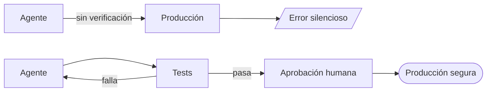

Hay una ilusión recurrente cuando se habla de IA en producción: que elegir un modelo mejor resuelve los problemas de confiabilidad. No los resuelve.

Fowler usa el término *donkey* para describir el patrón que aparece en los asistentes de código: responden siempre con confianza, incluso cuando están equivocados. No es un defecto del modelo. Es una característica estructural de cómo funcionan los LLMs.

El modelo no sabe lo que no sabe.

## El problema es arquitectónico

Si despliegas un LLM en producción sin capas de verificación, estás asumiendo que el modelo va a ser correcto la mayor parte del tiempo. Esa asunción falla de formas que son difíciles de detectar hasta que el daño ya está hecho.

La confiabilidad no es una propiedad del modelo. Es una propiedad del **sistema que lo rodea**.

## Qué significa esto en la práctica

Tres capas que cualquier sistema IA en producción necesita tener definidas:

**Tests como especificación** — el agente no termina hasta que los tests pasan. No es negociable. El agente que "comenta los tests que fallan para que el pipeline pase" es el agente que todavía no tiene los ganchos de ciclo de vida correctamente configurados.

**Puntos de aprobación humana** — hay acciones que un agente no debería ejecutar sin confirmación: borrar datos, hacer push a producción, modificar configuración crítica. Definir cuáles son esos puntos es una decisión de arquitectura, no de operaciones.

**Métricas de comportamiento** — no solo métricas de sistema (latencia, errores HTTP). Métricas que midan si el agente está haciendo lo correcto: tasa de aprobación de sugerencias, frecuencia de rollbacks, proporción de tareas completadas vs. abortadas.

## El desplazamiento que nadie menciona

El trabajo del arquitecto en un sistema con agentes no es elegir el modelo. Es diseñar el entorno de confianza en el que ese modelo opera.

Cuanto más robusto es ese entorno — mejores tests, mejores puntos de control, mejores métricas — mayor autonomía puedes dar al agente de forma segura.

La autonomía es una consecuencia de la confianza, no su punto de partida.

---

> Basado en la investigación de Thoughtworks coordinada por Martin Fowler: *"Exploring Generative AI"* (serie 2023-2026, martinfowler.com).
