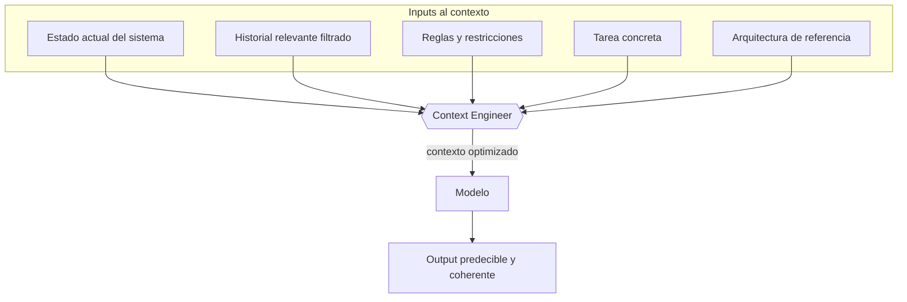
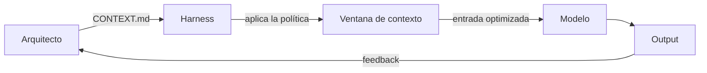

Hay una disciplina que está emergiendo en los equipos que trabajan con agentes IA en producción y que todavía no tiene un nombre estándar. Fowler y Thoughtworks la llaman **context engineering**.

No es prompting. Es algo más estructural.

## Qué es context engineering

Es el diseño deliberado de la ventana de contexto que recibe el modelo: qué información incluir, en qué orden, con qué formato, con qué restricciones.

La intuición detrás es simple pero sus implicaciones son profundas: **el comportamiento del agente es una función directa de su contexto**. No del modelo. Del contexto.

El context engineer decide lo que entra y lo que se queda fuera. Es una decisión de diseño con consecuencias directas en la calidad del output.

## Los dos errores opuestos

**Demasiado contexto:** el modelo pierde foco. Con una ventana de 200.000 tokens repleta de información, el modelo no sabe qué es relevante para la tarea inmediata. La calidad del output baja.

**Poco contexto:** el modelo inventa lo que no sabe. Sin información sobre la arquitectura existente, las convenciones del proyecto o las restricciones del dominio, genera código que funciona en abstracto pero no encaja en el sistema real.

El diseño de la ventana de contexto es un problema de balance con tradeoffs reales. No hay una respuesta universal.

## Por qué es una competencia de arquitectura

La razón por la que esto importa más allá del prompting es que las decisiones de context engineering son **decisiones de sistema**, no de sesión.

Qué documentos de arquitectura se incluyen siempre en el contexto. Qué parte del historial se comprime y cuál se descarta. Qué restricciones son obligatorias en cada tipo de tarea. Qué formato de respuesta esperamos para que sea parseable por el siguiente componente del sistema.

Estas decisiones no las toma el desarrollador en cada sesión. Las define el arquitecto una vez y el sistema las aplica siempre.

El resultado de hacer bien este trabajo: un agente cuyo comportamiento es predecible, reproducible y coherente con el sistema que lo rodea.

## La nueva pregunta del arquitecto

La pregunta ya no es "¿qué modelo uso?". Es "¿qué necesita saber el modelo para hacer bien este trabajo, y qué le sobra?".

Esa pregunta tiene respuestas distintas para cada tipo de tarea, cada etapa del flujo y cada nivel de autonomía que quieras otorgar al agente. Diseñar esas respuestas de forma sistemática es context engineering.

---

> Basado en la investigación de Thoughtworks coordinada por Martin Fowler: *"Exploring Generative AI"* (serie 2023-2026, martinfowler.com).
