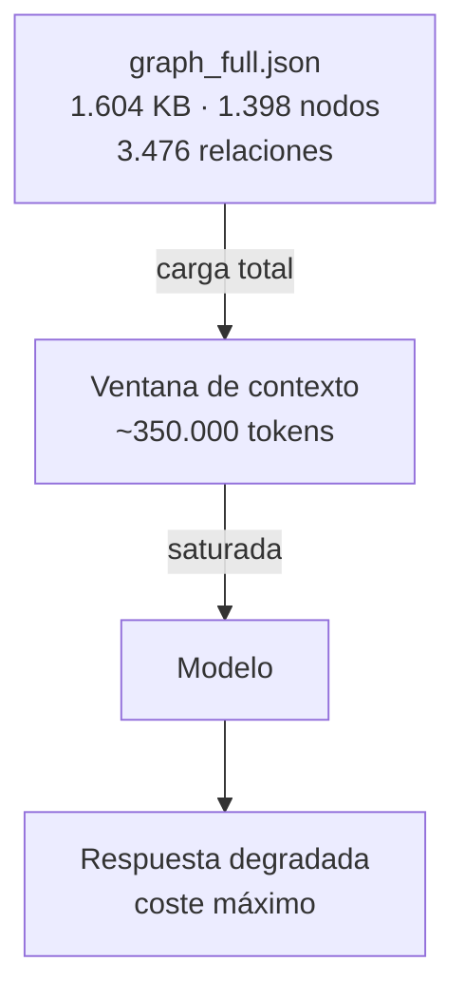
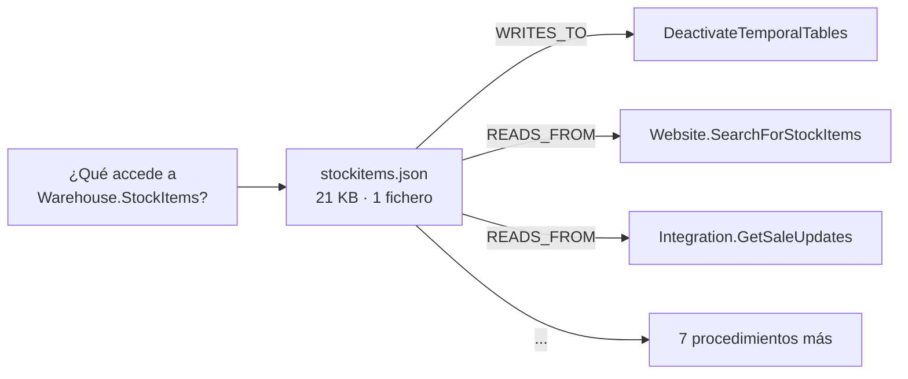
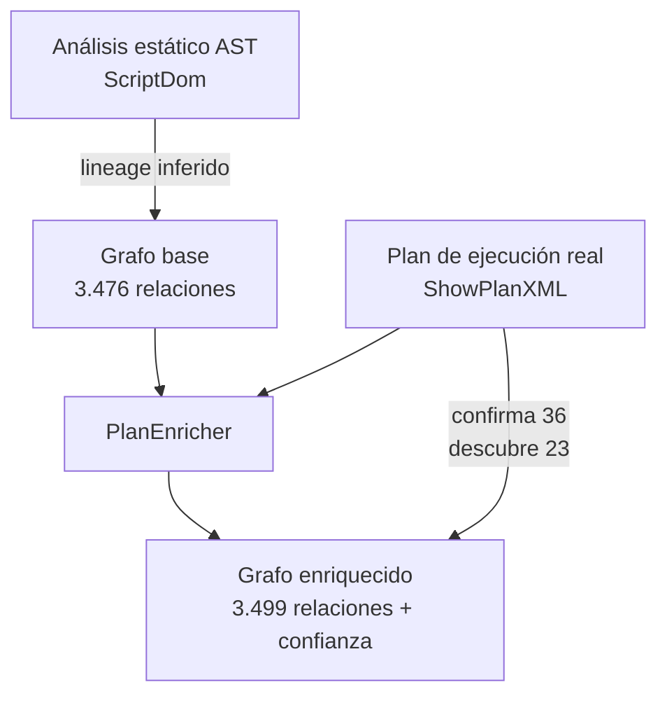

Cuando terminé de generar el grafo de lineage de WideWorldImporters contra SQL Server 2025, el resultado pesaba 1.604 KB. 1.398 nodos. 3.476 relaciones. Todo lo que el toolkit había encontrado: procedimientos, tablas, columnas, aristas tipadas con su dirección y confianza.

Lo conecté a un agente y le hice la pregunta más simple que existe: "¿qué procedimientos acceden a Warehouse.StockItems?".

El agente leyó el grafo entero para responderla.

## El problema no es el grafo. Es la forma en que lo entregas.

Un grafo de 1.600 KB son, según el modelo, entre 300.000 y 400.000 tokens. Dependiendo del contexto disponible, eso puede ser toda la ventana o más. Y la pregunta "¿qué accede a StockItems?" tiene respuesta en 21 KB.

No en 1.600. En 21.

El resto son ruido. Procedimientos de otras áreas. Columnas que no importan. FK a tablas que no se mencionan. El agente los procesa igual, porque no tiene forma de saber de antemano qué parte del grafo es relevante para la pregunta concreta que le estás haciendo.

Esto es exactamente lo que describe el [[04 Arquitectura IA/context-engineering|context engineering]]: demasiado contexto no ayuda al modelo a razonar mejor. Lo distrae. La calidad baja. El coste sube.



## El NodeStore: el grafo diseñado para ser navegado

La solución no es resumir el grafo. Es particionarlo de forma que el agente pueda recorrerlo por pasos.

Cada nodo vive en su propio fichero. El fichero del nodo `Warehouse.StockItems` tiene exactamente lo que un agente necesita para responder cualquier pregunta sobre esa tabla: sus atributos, sus aristas directas con tipo y dirección, y punteros a los ficheros de los nodos vecinos.

El agente no recibe el grafo. Recibe el punto de entrada que necesita. Luego navega.

Para responder "¿qué accede a Warehouse.StockItems?" el agente lee **1 fichero de 21 KB**. Dentro encuentra:

- `DeactivateTemporalTablesBeforeDataLoad` → WRITES_TO (ALTER)
- `ReactivateTemporalTablesAfterDataLoad` → WRITES_TO (ALTER)
- `Integration.GetPurchaseUpdates` → READS_FROM (SELECT JOIN)
- `Integration.GetSaleUpdates` → READS_FROM (SELECT JOIN)
- `Integration.GetStockItemUpdates` → READS_FROM (INSERT JOIN)
- `Website.CalculateCustomerPrice` → READS_FROM (SELECT)
- `Website.InsertCustomerOrders` → READS_FROM (INSERT JOIN)
- `Website.InvoiceCustomerOrders` → READS_FROM (INSERT JOIN)
- `Website.SearchForStockItems` → READS_FROM (SELECT)
- `Website.SearchForStockItemsByTags` → READS_FROM (SELECT)

Respuesta completa. **76 veces menos datos que el grafo completo.**



Si necesitas más detalle sobre uno de esos procedimientos, lees su fichero. Otro salto. Otros 3-15 KB. Nunca el grafo completo.

## Lo que descubrí al ejecutarlo: SQL Server 2025 rompe el parser

Cuando generé los planes de ejecución reales para enriquecer el grafo, el enricher no matcheó ningún procedimiento. Procs matched: 0.

Investigué el XML del plan y encontré el motivo: SQL Server 2025 cambió el formato. Las versiones anteriores usan `<StmtProc>` para identificar invocaciones de stored procedures. SQL Server 2025 usa `<StmtSimple StatementType="EXECUTE PROC"><StoredProc ProcName="...">`.

El parser del toolkit solo manejaba el formato clásico. Dos líneas de fix después, el enricher funcionó:

```
Plans: 1  Procs matched: 4  Confirmed: 36  Discovered: 23
```

**36 aristas estáticas confirmadas por el plan de ejecución real. 23 accesos a tablas que el análisis AST no había visto** — tablas temporales, tablas accedidas dentro de cursores, accesos que solo aparecen cuando el motor optimiza la consulta real.

Sin fusión con el plan de ejecución, esas 23 relaciones eran invisibles. Con ella, el grafo es completo.



## La pregunta que hay que hacerse antes de conectar cualquier dato a un agente

No es "¿cómo incluyo esto en el contexto?". Es "¿qué necesita saber el agente en cada paso, y qué es ruido en ese paso concreto?".

Si la respuesta es "todo", el dato no está diseñado para el agente. Está diseñado para el humano que lo construyó.

Los grafos, los catálogos de metadatos, los esquemas de base de datos: son estructuras pensadas para ser exploradas por personas que saben lo que buscan. Un agente no sabe lo que busca hasta que empieza a leer. Y si le das todo de golpe, lo que hace es procesar ruido en lugar de razonar.

El NodeStore no es una optimización. Es un cambio de modelo mental: el dato se diseña para ser navegado, no para ser consumido de una vez.

---

*El toolkit que generó estos números es open-source: [github.com/rcm-on/tsql-lineage-toolkit](https://github.com/rcm-on/tsql-lineage-toolkit). Análisis completo de WideWorldImporters en 3,8 segundos, sin cloud, sin telemetría. El fix de compatibilidad con SQL Server 2025 está incluido en la última versión.*
