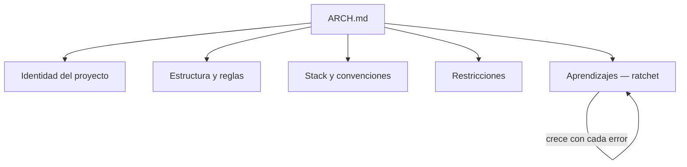

Un agente IA no recuerda nada entre sesiones. Cada vez que lo abres, empieza de cero.

Sin contexto, tomará decisiones que contradicen las que tomaste la semana pasada. Generará código que no encaja con la arquitectura existente. Usará convenciones distintas en cada sesión.

La solución no es un prompt mejor. Es un **documento de arquitectura base** — un archivo que vive en la raíz del repositorio y que el agente lee antes de actuar.

No es documentación. Es contexto operativo.

---

## Qué contiene un ARCH.md

Un documento de arquitectura base tiene cinco secciones que todo agente necesita:



### 1. Identidad del proyecto

Quién eres, qué construyes, para quién, qué tono usas. El agente necesita saber en qué dominio opera antes de generar cualquier cosa.

```markdown
## Qué es este proyecto
Blog técnico de [nombre] publicado con Quartz 4.
Dominio: Arquitectura de software, DevOps e IA.
Tono: directo, con criterio propio, sin hype.
```

### 2. Estructura y reglas de contenido

Dónde va cada tipo de archivo. Qué está prohibido tocar. Qué frontmatter es obligatorio.

Sin esta sección, el agente decide solo dónde poner las cosas — y decide diferente cada sesión.

### 3. Stack y convenciones

Las decisiones técnicas que ya tomaste. Qué librería usas para X. Qué patrón aplicas en Y. El agente no tiene que adivinar ni proponer alternativas que ya descartaste.

### 4. Restricciones de ejecución

Las acciones que nunca debe hacer: `git push --force`, borrar contenido sin confirmar, modificar archivos que son código upstream.

Esta sección es la que implementa los **ganchos de ciclo de vida** del harness en forma de reglas de lenguaje natural.

### 5. Aprendizajes acumulados — el efecto ratchet

La sección más importante. Cada vez que el agente comete un error y tú lo corriges, la lección se documenta aquí. El documento no puede "desaprender" — solo acumula.

```markdown
## Aprendizajes acumulados

- No usar `style fill:` en diagramas Mermaid: los colores hardcoded
  chocan con el tema del sitio.
- No añadir `\n` en labels de Mermaid: no se interpreta.
- El home solo enlaza artículos que ya existen.
```

Con el tiempo, esta sección se convierte en la memoria colectiva del proyecto.

---

## La estructura mínima viable

```markdown
# ARCH.md

## Qué es este proyecto
[2-3 líneas: qué construyes, para quién, con qué stack]

## Estructura
[árbol de carpetas + regla por carpeta]

## Convenciones
[las 5-10 reglas que más importan]

## Restricciones
[lo que nunca debe hacer el agente]

## Aprendizajes
[vacío al inicio, crece con el tiempo]
```

Empieza pequeño. Un ARCH.md de 30 líneas que se lee en 2 minutos es más útil que uno de 200 líneas que el agente ignora por exceso de contexto.

---

## Por qué funciona

El agente no toma mejores decisiones porque sea más inteligente con el ARCH.md. Las toma porque tiene **menos espacio para improvisar**.

Las decisiones ya están tomadas. Las convenciones ya están definidas. Las restricciones ya están documentadas.

El documento no aumenta la inteligencia del agente. Reduce su incertidumbre.

Y eso, en sistemas que operan en producción, es exactamente lo que necesitas.

---

> El `ARCH.md` de este proyecto está disponible en la raíz del repositorio como ejemplo concreto.
