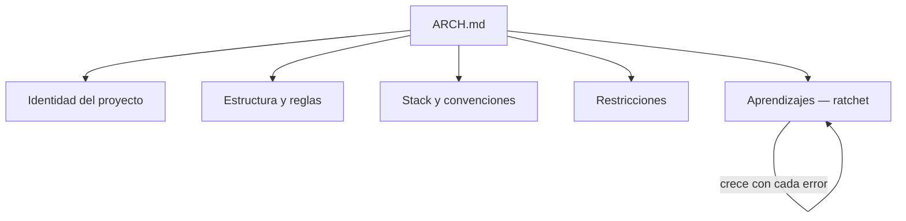

La tercera vez que el agente generó código que rompía las convenciones del proyecto, me rendí a la evidencia: el problema no era el modelo. Era que cada sesión empezaba sin memoria de las decisiones anteriores.

Le había dado el contexto en el prompt. Una vez. No era suficiente.

Lo que necesitaba era un documento que viviera en el repositorio, que el agente leyera antes de actuar en cada sesión, y que acumulara todo lo que ya había decidido sobre el proyecto. No para un auditor. No para un compañero nuevo. Para la herramienta con la que trabajo hoy.

Eso es un `ARCH.md`.

---

## Qué contiene

Cinco secciones. Cada una responde a una pregunta distinta que el agente necesita resuelta antes de actuar:



**Identidad** — quién eres, qué construyes, para quién, con qué tono. Sin esto, el agente opera en abstracto y sus decisiones son genéricas.

**Estructura** — dónde va cada tipo de archivo. Sin esta sección, el agente decide solo dónde poner las cosas. Y decide diferente cada sesión.

**Convenciones** — las decisiones técnicas que ya tomaste. Qué librería usas para X. Qué patrón aplicas en Y. El agente no tiene que adivinar ni proponer alternativas que ya descartaste.

**Restricciones** — las acciones que nunca debe ejecutar. `git push --force`, borrar contenido sin confirmar, modificar archivos que son código upstream. Esta sección es la que implementa los ganchos de ciclo de vida del harness en lenguaje natural.

**Aprendizajes** — la sección más importante. Cada vez que el agente comete un error y lo corriges, la lección se documenta aquí. El documento no puede desaprender — solo acumula.

```markdown
## Aprendizajes acumulados

- No usar `style fill:` en diagramas Mermaid: los colores hardcoded
  chocan con el tema del sitio.
- No añadir `\n` en labels de Mermaid: no se interpreta.
- El home solo enlaza artículos que ya existen en el repositorio.
```

Con el tiempo, esta sección se convierte en la memoria colectiva del proyecto.

---

## La estructura mínima viable

```markdown
# ARCH.md

## Qué es este proyecto
[2-3 líneas: qué construyes, para quién, con qué stack]

## Estructura
[árbol de carpetas + regla por carpeta]

## Convenciones
[las 5-10 reglas que más importan]

## Restricciones
[lo que nunca debe hacer el agente]

## Aprendizajes
[vacío al inicio, crece con el tiempo]
```

Empieza pequeño. Un ARCH.md de 30 líneas que se lee en 2 minutos es más útil que uno de 200 líneas que el agente ignora por exceso de contexto.

---

## Por qué funciona

El agente no toma mejores decisiones porque sea más inteligente con el ARCH.md. Las toma porque tiene menos espacio para improvisar.

Las decisiones ya están tomadas. Las convenciones ya están definidas. Las restricciones ya están documentadas.

El documento no aumenta la inteligencia del agente. Reduce su incertidumbre.

Y eso, en sistemas que trabajan contigo en producción, es exactamente lo que necesitas.

---

## Aplícalo

Copia esto a tu agente, en el repo de tu proyecto:

```text
Lee https://blog.rcmon.dev/04-Arquitectura-IA/documento-arquitectura-base
y su lab de ejemplo. Si mi proyecto ya tiene un ARCH.md (o equivalente),
audítalo contra sus criterios: ¿recoge las decisiones y su porqué, las
convenciones que importan y lo que el agente nunca debe hacer? ¿Se lee en
2 minutos? Si no existe, genera un borrador de 30 líneas: infiere lo que
puedas del repo y pregúntame solo lo que no esté escrito en ningún sitio.
```

---

> Relacionado: [[04 Arquitectura IA/harness-engineering-agentes-ia|Harness Engineering]] · [[04 Arquitectura IA/ratchet-efecto-memoria-agente|El efecto ratchet]]
