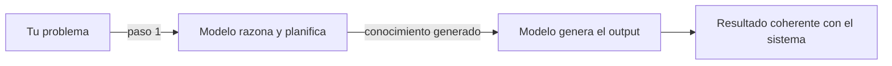
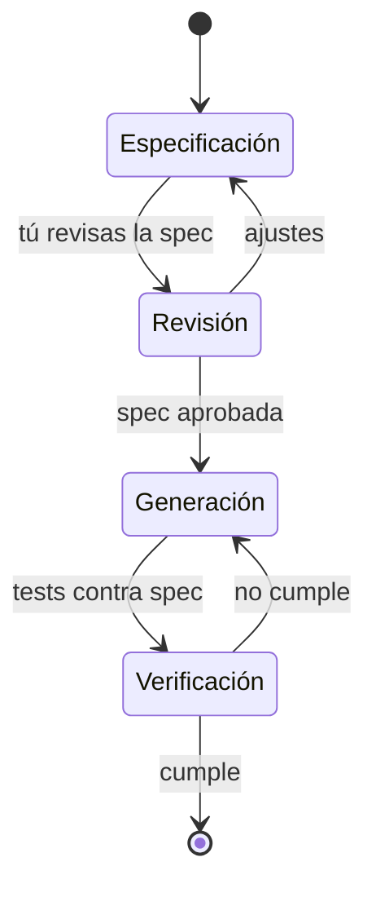

El error más común cuando empiezas a trabajar con LLMs en desarrollo de software es pedirle directamente lo que quieres. "Escribe una función que haga X." "Genera el componente Y."

El resultado suele ser correcto localmente e incorrecto sistémicamente.

Fowler y Thoughtworks documentan el patrón inverso: **primero el razonamiento, luego la generación**.

## Generated Knowledge Prompting

La idea es simple. En vez de pedir el output directamente, pides al modelo que genere información útil sobre el problema. Luego usas esa información como entrada para la generación final.

En la práctica: primero pides el plan de implementación. El modelo te explica cómo va a estructurar la solución, qué patrones va a aplicar, qué dependencias va a necesitar. Entonces sí pides el código, con ese plan como contexto.

La diferencia en calidad es notoria. No porque el modelo sea más inteligente — sino porque ha tenido que articular sus asunciones antes de actuar sobre ellas.

## Spec-Driven Development

El siguiente nivel del mismo principio: la especificación va antes que el código. Siempre.

No como documentación posterior. Como **el artefacto central** a partir del cual se genera, verifica y valida todo lo demás.

Lo que cambia aquí es el centro de gravedad del trabajo. No es el código lo que importa — es la especificación. El código es casi un derivado.

## Por qué esto importa para el arquitecto

Ambos patrones son variaciones de la misma idea: **separar el momento de pensar del momento de ejecutar**.

Los mejores ingenieros siempre han hecho esto. La diferencia es que ahora, si no lo haces explícitamente cuando trabajas con agentes, el modelo colapsa los dos pasos en uno y pierde precisión en ambos.

Obligar al modelo a razonar antes de generar no es solo una técnica de prompting. Es un patrón de diseño para el flujo de trabajo con agentes.

---

> Basado en la investigación de Martin Fowler: *"ChatGPT-Driven Development"* y *"Exploring Generative AI"* (martinfowler.com, 2023-2026).
