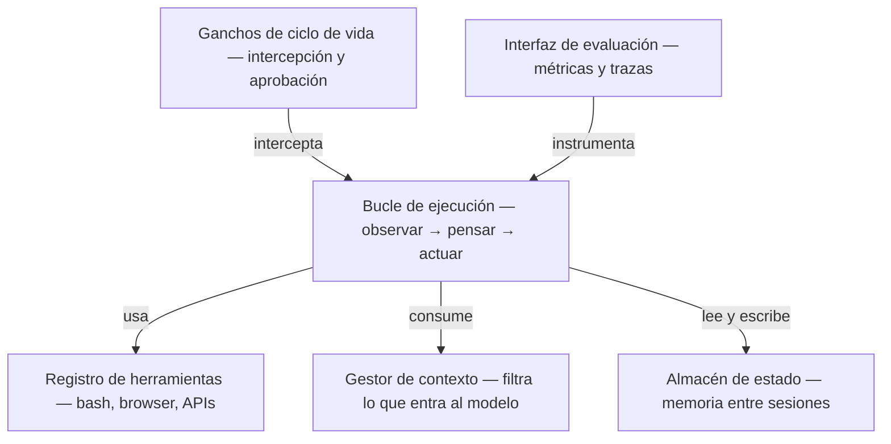
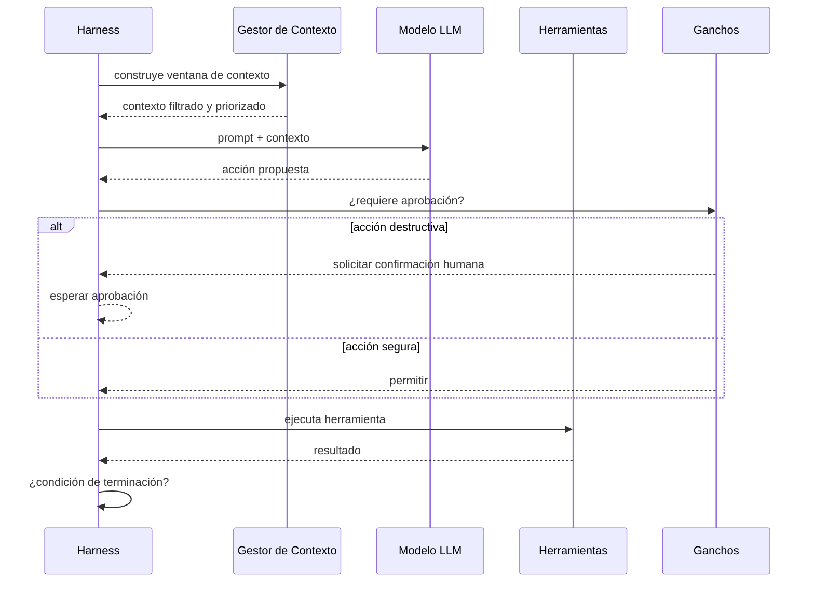
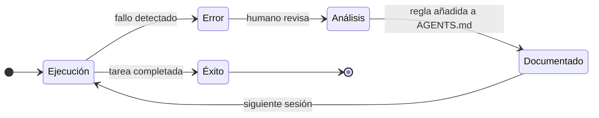
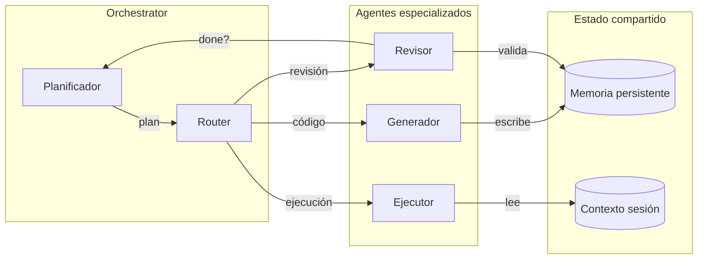

La primera vez que desplegué un agente IA en un proyecto real, cometí el error que comete todo el mundo: traté el modelo como si fuera suficiente.

Conecté la API, di instrucciones en el prompt, lo solté. Funcionó bien los primeros días. Luego empezaron los problemas: el agente tomaba decisiones que contradecían las del día anterior, ejecutaba acciones que no debía, ignoraba restricciones que yo asumía implícitas. El modelo no había cambiado. Yo no había cambiado. Pero el sistema fallaba.

El problema no era el modelo. Era que no había sistema.

---

## Qué es un harness

Un harness no es el modelo. Es todo lo que lo rodea: el ecosistema de software y reglas que controla cómo el agente observa, razona y ejecuta tareas de forma confiable en producción.

Tiene seis piezas interdependientes:



La mayoría de los proyectos que fallan en producción lo hacen porque ignoraron los ganchos (no hay supervisión humana en los momentos críticos) o la evaluación (no hay forma de saber si el agente está haciendo lo correcto).

---

## El ciclo que el modelo no ve

El agente observa, piensa y actúa. El harness decide cuándo dejar que actúe, cuándo pedir aprobación y cuándo parar.



Sin los ganchos, el agente ejecuta acciones irreversibles sin supervisión. Con ellos, tú defines exactamente qué nivel de autonomía se otorga y en qué condiciones.

---

## Markdown como infraestructura del harness

Aquí está el giro que más me sorprendió cuando lo entendí: gran parte del harness se implementa en archivos Markdown planos en la raíz del repositorio.

`AGENTS.md` y `MEMORY.md` — o `ARCH.md` según el proyecto — son el contexto y el estado del harness. No código. Texto.

```text
repositorio/
├── AGENTS.md       ← políticas, restricciones, roles
├── MEMORY.md       ← aprendizajes persistentes entre sesiones
└── src/
```

Cada vez que el agente comete un error y lo corriges, la lección va al Markdown. El harness no puede desaprender — solo acumula. Es el **efecto ratchet**: el sistema mejora sesión a sesión sin poder retroceder.



Un ejemplo concreto de cómo queda un `AGENTS.md` funcional:

```markdown
# AGENTS.md

## Contexto y restricciones
- La lógica de estado reside exclusivamente en la capa de servicios.
- Nunca comentar tests que fallan — repararlos o eliminarlos.
- Usar siempre `src/utils/logger.ts`, nunca `console.log`.

## Herramientas bloqueadas
- `rm -rf`, `git push --force`, `DROP TABLE` sin confirmación explícita.

## Antes de cualquier PR
- Ejecutar `npm run typecheck && npm run lint`.
```

---

## Orquestación multi-agente

Cuando el problema supera las capacidades de un agente, entra la orquestación. Frameworks como LangGraph y AutoGen implementan agentes especializados que comparten contexto a través del estado compartido.



La separación de roles no es opcional. El Agente Revisor valida contra la condición de terminación antes de que el orquestador avance. Sin este ciclo, los errores se propagan sin fricción.

---

## El cambio real

La IA generativa pedía al arquitecto que eligiera el modelo correcto. La ingeniería de arneses le pide algo distinto: diseñar el sistema de comportamientos que hace que ese modelo sea confiable en producción.

La autonomía de un agente no es una propiedad del modelo. Es una propiedad del harness.

Cuanto mejor diseñado esté el sistema que lo rodea — sus ganchos, su gestión de contexto, su estado, su evaluación — mayor y más segura puede ser la autonomía que le otorgas.

El arquitecto que entiende esto deja de preguntar "¿qué modelo uso?" y empieza a preguntar "¿qué comportamientos necesito garantizar y cómo los encuadro?".

Esa es la pregunta correcta.

---

> Relacionado: [[04 Arquitectura IA/documento-arquitectura-base|ARCH.md: el documento que le da memoria a tu agente]] · [[04 Arquitectura IA/ratchet-efecto-memoria-agente|El efecto ratchet]]
