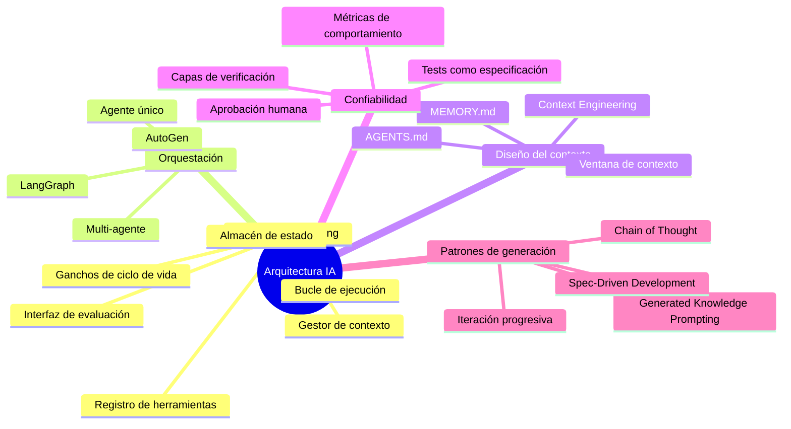

Diseñar sistemas de IA no es elegir el modelo correcto. Es diseñar el entorno que hace que ese modelo sea confiable, coherente y operable en producción.

## Artículos

- [[04 Arquitectura IA/harness-engineering-agentes-ia|Harness Engineering: el nuevo rol del arquitecto]]
- [[04 Arquitectura IA/arquitectura-como-contexto|La arquitectura no es solo para los humanos del equipo]]
- [[04 Arquitectura IA/genera-el-plan-primero|Pídele al modelo que piense antes de que genere]]
- [[04 Arquitectura IA/confiabilidad-no-viene-del-modelo|La confiabilidad de un agente no viene del modelo]]
- [[04 Arquitectura IA/context-engineering|Context Engineering: la disciplina que nadie está nombrando]]
- [[04 Arquitectura IA/documento-arquitectura-base|ARCH.md: el documento que le da memoria a tu agente]]
- [[04 Arquitectura IA/ratchet-efecto-memoria-agente|El efecto ratchet: cómo los agentes aprenden a no repetir errores]]
