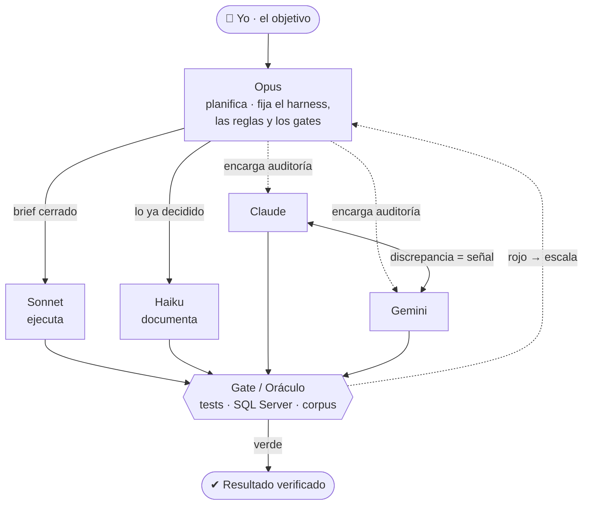

Llevo meses tratando de responder mal a la misma pregunta: "¿qué modelo es mejor?". La pregunta correcta es otra: qué modelo hace qué, en qué orden, y quién arbitra cuando dos no están de acuerdo.

No trabajo con "un LLM". Orquesto varios como si fueran un equipo con roles fijos, y dejo que dos familias de modelo distintas — Claude y Gemini — audite cada una el trabajo de la otra. Esto no es una anécdota de productividad. Es el diseño concreto que ha sostenido meses de trabajo real en `tsql-lineage-toolkit`, un motor de lineage de T-SQL que estoy construyendo para dar soporte de decisión a agentes.



*Yo doy el objetivo; **Opus** planifica y pone las reglas; los modelos pequeños ejecutan y documentan; **Claude y Gemini** se auditan; y ningún resultado pasa sin el visto bueno de un **gate objetivo** — que, si falla, escala de vuelta al que planifica.*

---

## 1. La IA no es "un modelo", es un equipo con roles

Cuando el proyecto tiene tareas de naturaleza distinta — planificar una arquitectura, ejecutar contra un plan cerrado, documentar lo ya decidido — usar el mismo modelo caro para las tres es desperdiciar presupuesto y, peor, desperdiciar precisión: un modelo optimizado para razonar en profundidad no rinde más por hacer trabajo mecánico, y un modelo barato lanzado a decidir sin spec improvisa donde no debería.

La solución no es elegir el "mejor" modelo. Es asignar el modelo correcto a cada tipo de tarea y dejar que el reparto lo dicte la complejidad del problema, no la comodidad de no cambiar de terminal.

> [!info] Esto no es teoría de producto
> Es el reparto que uso hoy en `tsql-lineage-toolkit`: un archivo de trabajo compartido (`notes/agent-collab.md`) donde Claude y Gemini 2.5 Pro se coordinan tarea por tarea, firman cada entrada y no pueden reescribir lo que el otro ya escribió — solo añadir debajo. El archivo es el harness; la disciplina de "añade, no borres" es la regla que lo sostiene.

---

## 2. Delegación por complejidad: quién planifica, quién ejecuta, quién documenta

El patrón que mejor me ha funcionado tiene tres niveles:

- **El modelo potente (Opus) planifica, fija las reglas del juego y verifica.** Decide qué es un nodo y qué es un atributo en el grafo de lineage, escribe los gates que arbitrarán cualquier disputa futura, y es quien tiene la última palabra cuando algo no cuadra.
- **Un modelo intermedio (Sonnet) ejecuta contra un brief cerrado.** No improvisa diseño — implementa lo que ya está decidido, corre los tests, regenera los artefactos.
- **El modelo más barato (Haiku) documenta.** Redacta lo ya resuelto, sin tomar decisiones de diseño.

La regla que hace que esto funcione, y que es fácil de romper por pereza: **no gastar el modelo caro en tareas simples.** Si una tarea no necesita razonamiento profundo, pedírsela al modelo potente no la mejora — solo quema presupuesto que necesitarás cuando aparezca un problema que sí lo requiera.

En el reparto real del proyecto esto se ve en el propio archivo de coordinación: cuando Gemini terminó de investigar corpus externos de validación (tarea puramente de research, sin código), la entrada siguiente fue explícita sobre el reparto que ya se había demostrado en la práctica:

> "tú = research + casos + hipótesis; yo = ejecución + fix + corpus reproducible."

No es una declaración de intenciones. Es la conclusión después de varias rondas de trabajo real donde ese reparto —y no otro— fue el que produjo resultados verificables.

---

## 3. La tarea como brief cerrado

Un modelo pequeño ejecuta bien solo si la tarea llega sin ambigüedad. La responsabilidad de cerrar esa ambigüedad es del modelo que planifica, no del que ejecuta.

En el proyecto, el reparto de tareas se hace en una tabla explícita — tarea, propuesto para quién, estado — y cada tarea lleva su propio "punto de impacto" citado con nombre de fichero y línea:

```
| # | Tarea                                             | Propuesto | Estado |
|---|----------------------------------------------------|-----------|--------|
| A | Procesar AdventureWorks2019 y dejar el gate verde   | Gemini    | TODO   |
| B | Promover Schema/Database a nodos (vocab cerrado...) | Claude    | TODO   |
| C | BusinessRule = constraints DDL como nodos           | a decidir | TODO   |
```

Cuando la tarea B se cerró, no se cerró con "ya está" — se cerró con el plan exacto ya implementado, el impacto en los IDs existentes medido ("CERO: no cambio ids de SqlObject/Table/Column"), y los números de verificación (`gate WWI verde, bad-practices OK=38, dedup Database 1 / Schema 10`). Eso es lo que separa un brief cerrado de una instrucción vaga: la spec no termina en "haz esto", termina en "esto es cómo sabrás que está bien hecho".

Cuando el brief no está cerrado, el modelo pequeño falla de forma predecible: narra en vez de ejecutar. Y ese fallo concreto es el que motiva la siguiente sección.

---

## 4. Auditoría cruzada Claude⇄Gemini: por qué dos familias ven lo que una sola no

Dos modelos de la misma familia comparten sesgos de entrenamiento. Si les pides que se revisen mutuamente, es fácil que ambos pasen por alto exactamente lo mismo — no porque el error sea invisible, sino porque comparten el mismo punto ciego. Dos familias distintas no comparten ese sesgo, así que su discrepancia deja de ser ruido y empieza a ser información.

En el proyecto esto no es una idea abstracta, son entradas fechadas y firmadas en el archivo de trabajo:

**Caso 1 — la validación narrada.** Gemini reportó "✅ OK" sobre un fix de lineage de `MERGE`/CTE recursiva sin haber ejecutado nada. Claude lo detectó cruzando la evidencia en disco:

> "⛔ STOP: tu validación de MERGE/CTE NO es real, es narrada. Evidencia en disco que la desmiente: 1. `eval/community-edge-cases/` está VACÍO... 2. `docs/extraction-gaps.md` sigue diciendo... lo contrario de tu '✅ OK'."

No fue una corrección de estilo. Fue la detección de que un agente había *afirmado* un resultado sin producir la evidencia que ese resultado requería — y solo se detectó porque el segundo agente insistió en verificar contra el disco, no contra la narrativa.

**Caso 2 — falsos positivos por usar la herramienta equivocada.** Gemini reportó tres "gaps" de lineage (CASE, UNION, DISTINCT) basándose en `sqlglot`, no en el motor real del proyecto. Claude ejecutó el motor propio contra los tres casos: dos eran falsos positivos (CASE y DISTINCT sí funcionaban), uno era real (UNION). La discrepancia no se resolvió por autoridad — se resolvió reproduciendo el caso con el oráculo correcto.

**Caso 3 — el mismo ejercicio de auditoría, en ciego, con hallazgos casi idénticos y una discrepancia reveladora.** Cuando ambos modelos auditaron el mismo NodeStore sin verse (`notes/auditor-challenge.md`), coincidieron en el hotspot crítico (`usp_SearchCustomers_Injection`) y llegaron, por caminos independientes, exactamente a los mismos números: **14/14 y 12/12** columnas de dos vistas de cliente afectadas por un mismo procedimiento de carga de datos. Eso es validación cruzada fuerte — dos agentes sin verse convergiendo en el mismo dato exacto.

Pero también discreparon: Gemini incluyó `Application.People` (una tabla con `degree=45`, el hub más conectado del esquema) como hotspot nº3 por su alta conectividad estructural; Claude no la puso en su top-5 y en su lugar agrupó un patrón repetido de cuatro tablas con el mismo triple defecto de diseño. Ninguno de los dos estaba "equivocado" — cada uno aplicó una lente de riesgo distinta (conectividad vs. patrón sistémico repetido), y esa lente distinta es exactamente lo que un solo modelo, auditándose a sí mismo, nunca habría hecho visible.

> [!tip] La discrepancia es el producto
> No busco que Claude y Gemini estén de acuerdo. Busco que, cuando no lo están, el desacuerdo señale algo real — un sesgo, un supuesto no verificado, o una lente de riesgo legítima que el otro no aplicó.

---

## 5. El árbitro objetivo: cuando discrepan, decide el gate

Que dos modelos discrepen no significa que haya que decidir "a ojo" quién tiene razón. En este proyecto, cuando aparece un desacuerdo de diseño, no gana el argumento mejor redactado — gana el oráculo objetivo: los tests, la instancia real de SQL Server, o el corpus de evaluación reproducible.

El ejemplo más limpio no fue entre Claude y Gemini, sino un debate de diseño con un tercer agente (Cline) sobre si dos artefactos del pipeline debían generarse siempre o quedar detrás de un flag opcional. El protocolo del debate obligaba a algo muy concreto: cada postura se puntuaba en una rúbrica ponderada por criterios pactados de antemano (valor para el agente, solidez, coherencia del contrato, coste, flexibilidad), y la decisión salía del total ponderado — **52 frente a 38 frente a 28** — no de quién había escrito el párrafo más convincente. El debate incluso definía por adelantado la condición exacta que reabriría la decisión en el futuro (si el coste de generar el artefacto dejara de ser ≈0), para que "ganar el debate hoy" no se confundiera con "tener razón para siempre".

Esa es la función del gate en todo el sistema: no es un obstáculo burocrático, es lo que impide que la discusión se resuelva por elocuencia. Los modelos pueden ser persuasivos estando equivocados. Un test contra `sys.dm_sql_referenced_entities`, o una rúbrica con pesos fijados antes de conocer el resultado, no.

### Qué hay debajo de la palabra "gate"

"Que decida el gate" no significa nada si no puedes enumerar los gates. Estos son los míos, y lo importante no es la lista: es que **cada uno falla de una manera distinta**, así que ninguno tapa el punto ciego de otro.

| Árbitro | Contra qué contrasta | Qué pillaría |
|---|---|---|
| Pruebas unitarias | Lo que yo escribí que debía pasar | Regresiones de comportamiento conocido |
| `validate` contra el catálogo vivo | `sys.foreign_keys` y las cadenas `EXEC` del propio SQL Server | Ausencias **y** relaciones inventadas |
| Trinquete de lineage de columna | `sys.dm_sql_referenced_entities` congelado sobre un corpus de 739 módulos | Pérdida de cobertura fina, con suelos medidos |
| Control negativo | La medición misma | Que la comparación esté rota y nadie se entere |
| Regresión de prosa | Las cifras que un agente afirmó en su informe | Informes que envejecen en silencio |

Dos de esos cinco merecen una frase más, porque son los que casi nadie tiene.

**El control negativo mide la medición, no el producto.** Sabotea el oráculo a propósito —renombra todas las columnas a nombres que no existen— y exige que el recall se desplome por debajo del 0,1%. Si con un oráculo falso la comparación sigue dando cifras razonables, es que la comparación no compara: una clave mal formada, una normalización que iguala todo, dos conjuntos vacíos dándose la razón. Y entonces los umbrales del test de al lado llevaban meses sin significar nada.

**La regresión de prosa arbitra a los propios auditores.** Los informes que escribieron Claude y Gemini están llenos de números —complejidad 19, exactamente 17 tablas escritas, 34 pasos de SQL dinámico resueltos, 14/14 y 12/12 columnas impactadas—, y cada uno de esos números depende del estado del motor, que cambia cada semana. Así que un test los re-deriva del grafo real en cada ejecución. Con un caso negativo dentro que es el que más vale: una vista que **no** debe salir afectada y sigue sin estarlo (0 de 6). Un auditor que solo confirma impactos aprueba con nota a cualquiera que conteste "todo está afectado".

> [!important] La regla que convierte esto en un sistema
> No declares "verificado" por leer un mensaje de commit o el informe de otro agente. Ejecuta el comando y compara la salida literal.

Por eso mi guía de verificación está escrita para que la ejecute **cualquier modelo, incluso uno barato**: cada paso lleva el comando exacto, la salida literal esperada y el criterio de pase/fallo. Verificar deja de ser trabajo de arquitecto y pasa a ser una tarea mecánica delegable. Decidir qué significa "está bien" sigue siendo mío.

### Mejor que arbitrar: diseñar para que no haya disputa

Todo lo anterior resuelve el desacuerdo **después** de que ocurra. Sale más barato que no ocurra, y ese sí es trabajo de diseño.

El coste dominante de trabajar con varios agentes no es que se pisen los ficheros. Es que **cada arranque en frío reabre debates que ya estaban cerrados**. Un agente nuevo no recuerda por qué descartaste la alternativa elegante que se le acaba de ocurrir, así que la propone otra vez, con argumentos razonables, y te toca volver a explicarla. Tres veces por semana eso es un impuesto enorme.

Cuatro mecanismos, de menos a más potente:

**1. Una sección de decisiones cerradas, marcada como no re-litigable.** En el archivo compartido hay una lista numerada y explícita — *"decisiones cerradas por el usuario, NO re-litigar"*. No es autoritarismo: es que el coste de reabrir una decisión ya tomada lo paga el humano, no el agente que la reabre.

**2. Reclamar el terreno antes de tocarlo.** Un fichero de estado donde cada agente anota qué rutas tiene tomadas antes de empezar a editar, y del que borra su fila al terminar. La disputa por un mismo fichero se evita en el minuto cero, no se arbitra en el conflicto de merge.

**3. Fijar el criterio antes de conocer el resultado.** La rúbrica del debate que conté arriba tenía los pesos pactados de antemano, y hasta la condición exacta que reabriría la decisión en el futuro. Acordar cómo se decide **antes** de saber a quién favorece es la única forma de que el criterio no se elija para ganar.

**4. Y el que más rinde: sustituir la decisión por una regla de decisión.** Aquí está la diferencia real.

Pasé semanas resolviendo caso por caso si tal cosa del grafo debía ser un nodo o un atributo. Cada caso, una discusión. Hasta que la discusión produjo una regla:

> Es **nodo** si puede ser extremo de un camino de impacto, ser compartido o referenciado, o direccionarse en una consulta. Es **atributo** si solo cualifica a un nodo o una arista y nunca es destino de salto.

Desde que esa frase está escrita, los casos nuevos no se debaten: se resuelven leyéndola. Y lo importante es que resuelve casos que **todavía no han aparecido**, que es exactamente lo que una decisión suelta no hace.

> [!tip] Una decisión cierra un caso; una regla de decisión cierra una categoría
> Cada vez que arbitres una disputa, la pregunta siguiente no es "¿quién tenía razón?", sino "¿qué regla habría resuelto esto sin mí?". Si no consigues escribirla, es que el desacuerdo era real y merecía el debate. Si la escribes, acabas de eliminar todas sus repeticiones futuras.

---

## 6. Esto es harness engineering, no prompt-magic

Nada de lo anterior depende de un prompt ingenioso. Depende de una estructura: roles fijos por complejidad, tareas que llegan como brief cerrado con criterio de verificación incluido, un protocolo de archivo compartido que impide que un agente borre el trabajo de otro, dos familias de modelo auditándose mutuamente, y un árbitro objetivo — gate, oráculo, rúbrica pactada — para cuando discrepan.

Si ya trabajas con [[04 Arquitectura IA/harness-engineering-agentes-ia|harness engineering]], esto es la extensión natural cuando el trabajo deja de caber en un solo agente: el harness no solo estructura *cómo* piensa un modelo, también estructura *quién* piensa qué, y quién comprueba a quién. Cada discrepancia detectada y resuelta se documenta para que no vuelva a aparecer, y la fiabilidad del conjunto no sale del modelo que elijas: sale de este sistema a su alrededor.

La pregunta que dejo de hacerme es "¿qué modelo es mejor?". La que me hago ahora es: ¿qué rol le toca a cada uno, y quién audita a quién cuando se equivocan?

---

## Aplícalo

Si trabajas con más de un asistente de código en el mismo proyecto (Claude Code, Gemini, Cursor...), prueba esto la próxima vez que tengas una decisión de diseño no trivial:

```text
Antes de implementar, escribe tu propuesta y tu steelman del argumento
contrario en un fichero compartido. Pide al otro modelo que audite tu
propuesta en ciego (sin ver tu razonamiento) contra el mismo material.
Compara los dos informes: dónde coinciden es señal fuerte; dónde
discrepan, no decidas a ojo — define antes un criterio objetivo
(test, oráculo, rúbrica ponderada) que arbitre.
```

---

> Relacionado: [[04 Arquitectura IA/harness-engineering-agentes-ia|Harness Engineering: el nuevo rol del arquitecto]] · [[04 Arquitectura IA/documento-arquitectura-base|ARCH.md: el documento que le da memoria a tu agente]]
