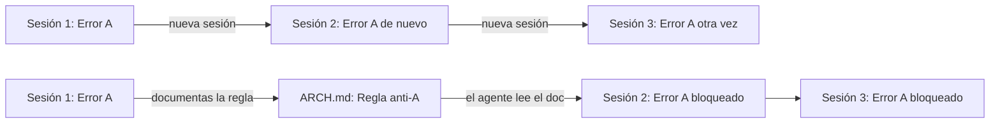
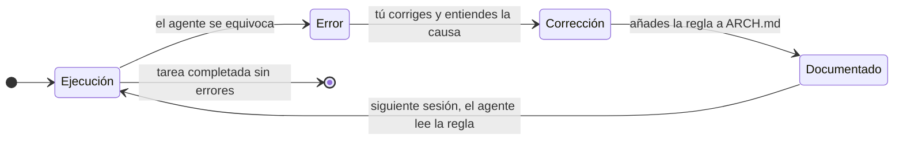
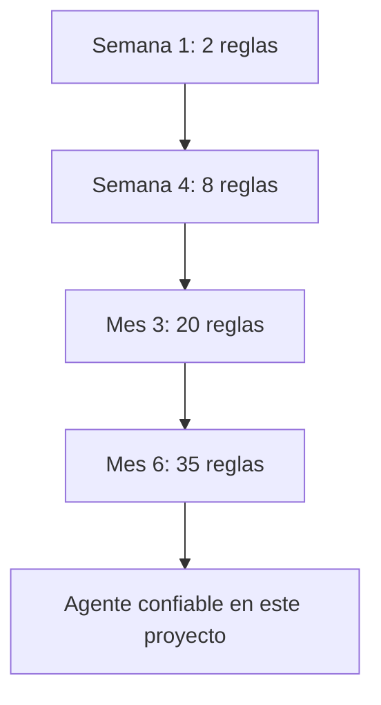

Un ratchet es un mecanismo mecánico que solo gira en una dirección. Puede avanzar. No puede retroceder.

En ingeniería de agentes IA, el **efecto ratchet** describe el principio más simple y más poderoso para hacer que un agente mejore con el tiempo:

> Cada error que cometes, corriges y documentas se convierte en una restricción permanente. El sistema no puede desaprender.

---

## El problema que resuelve

Un agente IA sin memoria entre sesiones comete los mismos errores repetidamente. No porque sea incapaz de corregirse — es que genuinamente no recuerda haberlos cometido.



Sin el ratchet: el error se repite indefinidamente.
Con el ratchet: el error ocurre una vez. Solo una.

---

## Cómo funciona en la práctica

El ciclo tiene cuatro pasos:



Lo crítico es el paso de **Corrección → Documentado**. Muchos equipos corrigen el error pero no lo documentan — y el ciclo se reinicia en la próxima sesión.

---

## Qué documentar exactamente

No el error en sí — la **regla que lo previene**.

| Error del agente | Lo que NO documentes | Lo que SÍ documentes |
| ---------------- | ------------------- | ------------------- |
| Usó `console.log` en vez del logger | "El agente usó console.log" | "Usar siempre `src/shared/logger.ts`. Nunca `console.log`." |
| Comentó un test que fallaba | "El agente comentó un test" | "Nunca comentar tests que fallan. Arreglarlos o eliminarlos." |
| Añadió lógica de negocio en el controlador | "El agente mezcló capas" | "La lógica de negocio reside en `domain/`. Nunca en `api/`." |
| Generó una migración no idempotente | "La migración falló en CI" | "Las migraciones deben ser idempotentes — el pipeline las ejecuta en cada deploy." |

La regla debe ser accionable, concreta y verificable. Si no se puede comprobar si se cumple, no sirve.

---

## Las propiedades del ratchet

### Solo avanza

Una vez que una regla está documentada, no se elimina. Puede refinarse, pero no borrarse. Si la regla era incorrecta, se añade una nueva que la matiza.

Esto es intencional: la presión de no poder retroceder obliga a escribir reglas buenas desde el principio.

### Escala con el tiempo



Al principio el agente comete muchos errores. Con el tiempo, el espacio de errores posibles se reduce sesión a sesión. No porque el modelo haya mejorado — porque el contexto que le das es más preciso.

### Es específico del proyecto

Las reglas del ratchet no son universales. Son las reglas que emergen de las decisiones concretas de *este* proyecto: este stack, esta arquitectura, estas convenciones, este equipo.

Un agente con el ratchet de otro proyecto no te sirve. Tienes que construir el tuyo.

---

## El ratchet como documento vivo

La sección de aprendizajes del `ARCH.md` es donde vive el ratchet. Su formato es simple:

```markdown
## Aprendizajes acumulados

- 2026-03-10 — Nunca usar `any` en TypeScript aunque compile.
  El type checker pierde valor y los errores aparecen en runtime.

- 2026-04-02 — Las migraciones deben ser idempotentes.
  El pipeline las ejecuta en cada deploy; si no son idempotentes, fallan.

- 2026-05-01 — Los tests de integración necesitan `afterEach` que limpie
  la base de datos. Sin limpieza, los tests se contaminan entre sí.
```

Tres elementos por entrada: **fecha**, **regla**, **por qué**. La fecha permite ver la historia. La regla es la restricción. El por qué evita que alguien la elimine sin entender su origen.

---

## Lo que el ratchet no es

**No es un log de errores.** Un log registra lo que pasó. El ratchet registra lo que no debe volver a pasar — y en forma de regla, no de anécdota.

**No es documentación técnica.** La documentación describe cómo funciona el sistema. El ratchet describe cómo debe trabajar el agente con ese sistema.

**No sustituye a los tests.** Los tests verifican que el código funciona. El ratchet previene que el agente genere código que viole las convenciones del proyecto, algo que los tests no cubren.

---

## Por qué importa más de lo que parece

La mayoría de los problemas con agentes en producción no son problemas de capacidad del modelo. Son problemas de contexto acumulado.

El agente que falla repetidamente en el mismo punto no necesita un modelo más potente. Necesita una regla documentada que le diga exactamente qué no hacer en ese punto.

El ratchet convierte la experiencia de trabajar con el agente en una ventaja compuesta. Cada sesión aporta algo al siguiente. El conocimiento no se pierde cuando cierras el editor.

Es la diferencia entre un agente que parece inteligente en una demo y uno que es confiable en producción.

---

> Ver también: [[04 Arquitectura IA/documento-arquitectura-base|ARCH.md: el documento que le da memoria a tu agente]] · [[02 Laboratorios/arch-md-ejemplo|Lab: ARCH.md ejemplo completo]]
