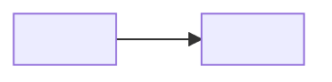

> **Doble objetivo del lab: configurar Y aprender, paso a paso.** No es una receta que
> se copia (configurar sin más) ni una charla teórica (aprender sin manos): es montar
> algo real y, en el mismo camino, entender el porqué de cada paso. El lector reproduce,
> rompe a propósito y comprueba lo aprendido. Borra este bloque y las guías en cursiva
> al escribir el lab real.

## El problema

_La deuda o el dolor concreto que justifica este lab. Empieza por el problema real,
no por "vamos a montar X". Si no hay un problema que duela, no hay lab._

## Qué vas a aprender

_El contrato de aprendizaje: 2-3 conceptos explícitos y transferibles. No "montar X",
sino qué patrón/idea sabrás aplicar en tu propio trabajo después._

- …
- …

## Modelo mental

_El patrón y su arquitectura ANTES del código. Un diagrama vale más que el compose._



## Manos a la obra

_Paso a paso, y en cada paso el **porqué**, no solo el comando: qué haces, por qué
se hace así y qué evita. Ahí está el "aprender configurando". Cada bloque termina con
un **checkpoint** verificable ("deberías ver…", "responde 200", "aparece en los logs…").
Sin porqué y sin checkpoint no se aprende, se copia a ciegas._

```bash

```

> [!check] Checkpoint
> Deberías ver…

## Rómpelo a propósito

_Aquí se aprende de verdad. Provoca el fallo: apaga un componente, quita una clave,
manda una petición inválida. Observa qué pasa y por qué el sistema reacciona así.
El comportamiento no se entiende leyéndolo, se entiende viéndolo fallar._

- **Experimento:** …
- **Qué observas:** …
- **Por qué:** …

## Mídelo: la comparativa

_Cuando el valor del lab es una mejora **medible** (menos tokens, menos coste, menos
latencia), no la afirmes: demuéstrala con una comparación **limpia**. Usa **dos agentes
con el mismo modelo** y **contexto fresco** cada uno — uno con la solución del lab, otro
sin ella — para que ninguno se contamine del trabajo del otro. Cierra con una tabla
comparativa y **guárdala como un `.md`** (con fecha), para que el número quede y sea
reproducible. La cifra es la del lector, nunca la de marketing._

| Métrica | Sin la solución | Con la solución |
|---|---|---|
| … | … | … |
| **Mejora** | — | **… ×** |

## Prueba tú

_Un reto abierto de extensión. Lo haces solo o con tu agente. Sin solución cerrada:
el objetivo es que apliques el concepto, no que copies una respuesta._

## Qué te llevas

_El patrón destilado en 2-3 frases. Lo que aplicarás en tu trabajo real, separado
de los detalles concretos de esta herramienta._

## Reprodúcelo con tu agente

_El blog como laboratorio: cómo rehacer esto con un agente IA a tu lado._
_Qué contexto darle, qué archivos necesita, y qué debe verificar en cada checkpoint._

## Cuestionario para tu agente

_La definición de "hecho". NO es un quiz conceptual: son estados **comprobables**
(sí/no) que tu agente marca antes de dar el lab por terminado. Impide que cante
victoria sin haber verificado. Cada punto debe poder confirmarse ejecutando algo._

- [ ] ¿Responde el checkpoint principal (health, endpoint, salida esperada)?
- [ ] ¿Se provocó y observó el fallo de "Rómpelo a propósito"?
- [ ] ¿Las claves/secretos están solo donde deben y no en el código versionado?
- [ ] ¿Informó del resultado final (endpoints, nombres, credenciales generadas)?

## Comprueba lo aprendido

_Para el humano. 3-5 preguntas de autoevaluación sobre los conceptos, no sobre los
comandos. Respuesta plegable para que el lector piense primero._

> [!question]- ¿Pregunta 1?
> Respuesta.

> [!question]- ¿Pregunta 2?
> Respuesta.

> [!question]- ¿Pregunta 3?
> Respuesta.

## Referencias

-
